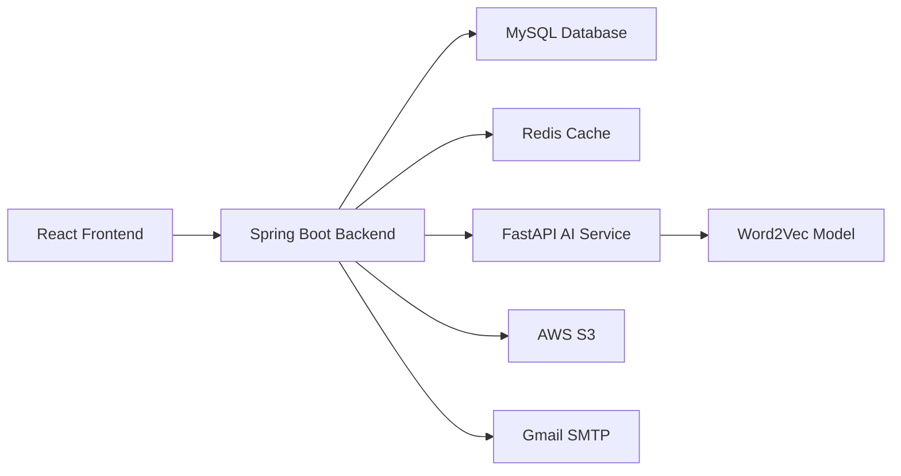

# 📄 **요구사항 정의서 (Requirements Specification)**

> **프로젝트명**: Memory Forest - AI 기반 치매 케어 인지 훈련 플랫폼
> 
> **개발환경**: Spring Boot 3.5.4, React 19, FastAPI, MySQL 8.0, Redis
> 
> **작성일**: 2025.01.15
> 
> **작성자**: 시스템 분석가

---

## ✅ 1. 개요

| 항목 | 내용 |
| --- | --- |
| **프로젝트 명** | AI 기반 치매 케어 인지 훈련 플랫폼 개발 |
| **목적** | 치매 환자의 인지 기능 유지 및 개선을 위한 AI 기반 개인화 훈련 시스템 제공 |
| **범위** | 사용자 인증, AI 분석, 게임 시스템, 진행도 추적, 가족 공유, 관리자 기능 |
| **주요 사용자** | 치매 환자, 돌봄 가족, 의료진, 관리자 |
| **플랫폼** | 웹 브라우저(PC, 모바일) 기반, 반응형 웹 |

---

## ✅ 2. 시스템 구성도

---

## ✅ 3. 기능 요구사항 상세

### **3.1 사용자 관리 기능**

| 요구사항 ID | 기능명 | 설명 | 우선순위 | 관련 페이지 | 비고 |
| --- | --- | --- | --- | --- | --- |
| FR-001 | 회원가입 | 이메일, 비밀번호, 이름, 전화번호 입력 후 가입 | 높음 🔴 | /auth/register | 이메일 인증 필수 |
| FR-002 | OAuth2 로그인 | Naver 소셜 로그인 지원 | 높음 🔴 | /auth/login | JWT 토큰 발급 |
| FR-003 | 이메일 인증 | 회원가입 시 이메일 인증 코드 발송 및 확인 | 높음 🔴 | /auth/verify | Gmail SMTP 사용 |
| FR-004 | JWT 토큰 관리 | 로그인 후 JWT 토큰 발급 및 갱신 | 높음 🔴 | - | Redis에 토큰 저장 |
| FR-005 | 사용자 프로필 | 개인정보 조회 및 수정, 비밀번호 변경 | 중간 🟠 | /user/profile | 프로필 이미지 업로드 |

### **3.2 AI 분석 기능**

| 요구사항 ID | 기능명 | 설명 | 우선순위 | 관련 페이지 | 비고 |
| --- | --- | --- | --- | --- | --- |
| FR-006 | 이미지 분석 | 업로드된 이미지의 객체 인식 및 태그 생성 | 높음 🔴 | /ai/analyze | Word2Vec 모델 활용 |
| FR-007 | 텍스트 분석 | 이미지 설명 텍스트의 키워드 추출 및 분석 | 높음 🔴 | /ai/analyze | KoNLPy 기반 한국어 처리 |
| FR-008 | 감정 분석 | 텍스트 내용의 감정 상태 분석 | 중간 🟠 | /ai/analyze | 긍정/부정/중립 분류 |
| FR-009 | 연관어 생성 | 분석된 키워드 기반 유사한 단어 추천 | 중간 🟠 | /ai/analyze | Word2Vec 유사도 계산 |

### **3.3 게임 시스템 기능**

| 요구사항 ID | 기능명 | 설명 | 우선순위 | 관련 페이지 | 비고 |
| --- | --- | --- | --- | --- | --- |
| FR-010 | 이미지-명사 매칭 | AI 분석 결과를 바탕으로 한 4지선다 게임 | 높음 🔴 | /game/play | 적응형 난이도 적용 |
| FR-011 | 적응형 난이도 | 사용자 성과에 따른 게임 난이도 자동 조절 | 높음 🔴 | /game/play | 성공률 기반 조정 |
| FR-012 | 점수 계산 | 정답 여부, 반응시간, 유사도 기반 점수 산정 | 높음 🔴 | /game/result | 종합 점수 계산 |
| FR-013 | 게임 세션 관리 | 게임 시작부터 종료까지의 세션 정보 관리 | 중간 🟠 | /game/session | Redis에 세션 저장 |

### **3.4 진행도 추적 기능**

| 요구사항 ID | 기능명 | 설명 | 우선순위 | 관련 페이지 | 비고 |
| --- | --- | --- | --- | --- | --- |
| FR-014 | 게임 결과 저장 | 게임 플레이 결과의 상세 정보 저장 | 높음 🔴 | /game/result | MySQL에 결과 저장 |
| FR-015 | 진행도 차트 | 일별/주별/월별 성과 변화 시각화 | 높음 🔴 | /dashboard/charts | ApexCharts 활용 |
| FR-016 | 성과 리포트 | 정답률, 반응시간, 일관성 지수 분석 | 중간 🟠 | /dashboard/report | PDF 생성 지원 |
| FR-017 | 개인화 추천 | 사용자 성과 기반 게임 콘텐츠 추천 | 중간 🟠 | /dashboard/recommend | AI 기반 추천 |

### **3.5 콘텐츠 관리 기능**

| 요구사항 ID | 기능명 | 설명 | 우선순위 | 관련 페이지 | 비고 |
| --- | --- | --- | --- | --- | --- |
| FR-018 | 이미지 업로드 | 가족 사진 및 게임용 이미지 업로드 | 높음 🔴 | /content/upload | AWS S3 저장 |
| FR-019 | 메타데이터 관리 | 이미지 설명, 태그, 카테고리 정보 관리 | 중간 🟠 | /content/manage | AI 분석 결과 연동 |
| FR-020 | 콘텐츠 검색 | 키워드, 카테고리, 날짜 기반 콘텐츠 검색 | 중간 🟠 | /content/search | Elasticsearch 고려 |
| FR-021 | 콘텐츠 공유 | 가족 간 콘텐츠 공유 및 권한 관리 | 낮음 🟡 | /content/share | 가족 그룹 기능 |

### **3.6 가족 공유 기능**

| 요구사항 ID | 기능명 | 설명 | 우선순위 | 관련 페이지 | 비고 |
| --- | --- | --- | --- | --- | --- |
| FR-022 | 가족 그룹 생성 | 환자와 가족을 연결하는 그룹 생성 | 높음 🔴 | /family/create | 초대 코드 발급 |
| FR-023 | 진행도 모니터링 | 가족이 환자의 게임 진행도 실시간 확인 | 높음 🔴 | /family/monitor | 실시간 알림 |
| FR-024 | 알림 시스템 | 게임 완료, 성과 변화 등 중요 이벤트 알림 | 중간 🟠 | /family/notify | 이메일, 푸시 알림 |
| FR-025 | 가족 소통 | 가족 간 메시지 교환 및 상담 기록 | 낮음 🟡 | /family/chat | 채팅 기능 |

### **3.7 관리자 기능**

| 요구사항 ID | 기능명 | 설명 | 우선순위 | 관련 페이지 | 비고 |
| --- | --- | --- | --- | --- | --- |
| FR-026 | 사용자 관리 | 전체 사용자 목록, 권한 관리, 계정 상태 관리 | 높음 🔴 | /admin/users | 검색, 필터링 |
| FR-027 | 콘텐츠 관리 | 업로드된 콘텐츠 검토, 승인, 삭제 | 높음 🔴 | /admin/content | AI 분석 품질 관리 |
| FR-028 | 게임 통계 | 전체 사용자의 게임 통계 및 분석 | 중간 🟠 | /admin/statistics | 대시보드 제공 |
| FR-029 | 시스템 모니터링 | 서버 상태, AI 모델 성능, 데이터베이스 상태 | 중간 🟠 | /admin/monitor | 실시간 모니터링 |

---

## ✅ 4. 비기능 요구사항

| ID | 항목 | 내용 |
| --- | --- | --- |
| NFR-001 | **성능** | 100명 동시 접속 시 2초 이내 응답, 게임 로딩 3초 이내 |
| NFR-002 | **보안** | HTTPS, JWT 토큰, OAuth2, 데이터 암호화, CSRF 방어 |
| NFR-003 | **가용성** | 99.9% 가용성, 자동 장애 복구, 다중 가용영역 |
| NFR-004 | **확장성** | 수평적 확장 지원, 마이크로서비스 아키텍처 |
| NFR-005 | **접근성** | WCAG 2.1 AA 기준 준수, 고령자 친화적 UI/UX |
| NFR-006 | **호환성** | Chrome, Edge, Safari, Firefox 최신 버전 지원 |
| NFR-007 | **데이터 보존** | 사용자 데이터 7년 보존, 백업 및 복구 시스템 |
| NFR-008 | **국제화** | 한국어 기본 지원, 향후 다국어 확장 고려 |

---

## ✅ 5. 시스템 제약사항

### **5.1 기술적 제약사항**
- Java 21 이상, Spring Boot 3.x 필수
- MySQL 8.0 이상, Redis 7.0 이상
- Python 3.10 이상, FastAPI 0.111.0 이상
- React 19.0 이상, Node.js 18.0 이상

### **5.2 비즈니스 제약사항**
- 의료법 관련 규정 준수
- 개인정보보호법 완전 준수
- 장애인차별금지법 접근성 기준 준수
- 치매 관련 의료진 자문 필수

### **5.3 운영 제약사항**
- 24/7 서비스 운영
- 정기 백업 및 업데이트
- 보안 취약점 정기 점검
- 사용자 데이터 백업 및 복구

---

## ✅ 6. 인터페이스 요구사항

### **6.1 사용자 인터페이스**
- 반응형 웹 디자인 (모바일 우선)
- 고령자 친화적 UI/UX (큰 글씨, 명확한 색상)
- 직관적인 네비게이션 및 메뉴 구조
- 접근성 가이드라인 준수

### **6.2 외부 시스템 인터페이스**
- Naver OAuth2 API 연동
- Gmail SMTP 서버 연동
- AWS S3 API 연동
- 의료기관 API 연동 (향후 확장)

---

## ✅ 7. 데이터 요구사항

### **7.1 데이터 저장**
- 사용자 정보, 게임 결과, AI 분석 결과
- 이미지 파일 (AWS S3), 메타데이터 (MySQL)
- 세션 정보 (Redis), 로그 데이터 (파일/DB)

### **7.2 데이터 백업**
- 일일 자동 백업 (MySQL, 파일)
- 주간 전체 백업 및 복구 테스트
- 30일간 백업 데이터 보존

---

## ✅ 8. 품질 요구사항

### **8.1 소프트웨어 품질**
- 코드 커버리지 80% 이상
- 정적 분석 도구 활용 (SonarQube)
- 코드 리뷰 필수, 품질 게이트 통과

### **8.2 테스트 요구사항**
- 단위 테스트, 통합 테스트, 시스템 테스트
- 사용자 수용 테스트 (치매 환자, 가족 대상)
- 성능 테스트, 보안 테스트

---

**문서 정보**
- 작성일: 2025년 1월 15일
- 버전: v1.0
- 작성자: 시스템 분석가
- 검토자: 프로젝트 매니저
- 승인자: 기술 책임자
