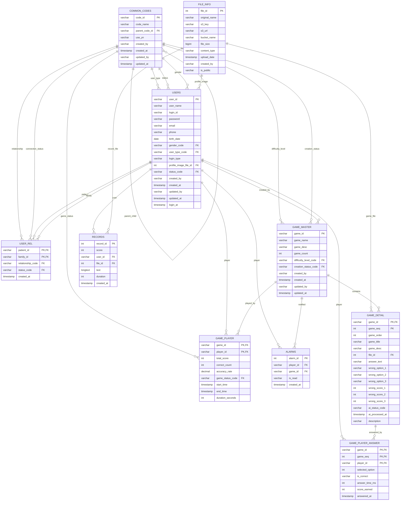

# 📄 **ERD 설계서 (Entity Relationship Diagram)**

> **프로젝트명**: Memory Forest - AI 기반 치매 케어 인지 훈련 플랫폼
> 
> **작성일**: 2025.01.15
> 
> **작성자**: 데이터베이스 설계자

---

## 📋 1. 데이터베이스 개요

### **1.1 데이터베이스 정보**
- **DBMS**: MySQL 8.0
- **문자셋**: UTF-8
- **정렬규칙**: utf8mb4_unicode_ci
- **엔진**: InnoDB

### **1.2 주요 특징**
- **사용자 관리**: OAuth2, JWT, 이메일 인증 지원
- **게임 시스템**: 게임 마스터, 상세, 플레이어 정보 관리
- **가족 공유**: 사용자 관계, 권한, 알림 관리
- **콘텐츠 관리**: 파일 정보, 녹음 기록 관리
- **공통코드**: 계층적 구조의 코드 관리 시스템

---

## 🗂️ 2. 테이블 정의서

### **2.1 공통코드 관련 테이블**

#### **📌 `common_codes` 테이블**

| 컬럼명 | 자료형 | PK | FK | NULL 허용 | 기본값 | 설명 |
| --- | --- | --- | --- | --- | --- | --- |
| `code_id` | VARCHAR(6) | ✅ |  | ❌ |  | 공통코드 ID (6자리 고정) |
| `code_name` | VARCHAR(100) |  |  | ❌ |  | 공통코드명 |
| `parent_code_id` | VARCHAR(6) |  | ✅ | ✅ | null | 부모 코드 ID (계층 구조) |
| `use_yn` | VARCHAR(1) |  |  | ❌ | 'Y' | 사용 여부 |
| `created_by` | VARCHAR(10) |  |  | ❌ |  | 생성자 |
| `created_at` | TIMESTAMP |  |  | ❌ | CURRENT_TIMESTAMP | 생성일시 |
| `updated_by` | VARCHAR(10) |  |  | ✅ | null | 수정자 |
| `updated_at` | TIMESTAMP |  |  | ✅ | null | 수정일시 |

### **2.2 파일 관리 관련 테이블**

#### **📌 `file_info` 테이블**

| 컬럼명 | 자료형 | PK | FK | NULL 허용 | 기본값 | 설명 |
| --- | --- | --- | --- | --- | --- | --- |
| `file_id` | INT | ✅ |  | ❌ | auto | 파일 ID (자동증가) |
| `original_name` | VARCHAR(255) |  |  | ❌ |  | 원본 파일명 |
| `s3_key` | VARCHAR(500) |  |  | ❌ |  | S3 객체 키 |
| `s3_url` | VARCHAR(1000) |  |  | ❌ |  | S3 접근 URL |
| `bucket_name` | VARCHAR(100) |  |  | ❌ |  | S3 버킷명 |
| `file_size` | BIGINT |  |  | ✅ | null | 파일 크기 |
| `content_type` | VARCHAR(100) |  |  | ✅ | null | 컨텐츠 타입 |
| `upload_date` | TIMESTAMP |  |  | ❌ | CURRENT_TIMESTAMP | 업로드일시 |
| `created_by` | VARCHAR(10) |  |  | ✅ | null | 생성자 ID |
| `is_public` | VARCHAR(1) |  |  | ❌ | 'N' | 공개/비공개 여부 |

### **2.3 사용자 관련 테이블**

#### **📌 `users` 테이블**

| 컬럼명 | 자료형 | PK | FK | NULL 허용 | 기본값 | 설명 |
| --- | --- | --- | --- | --- | --- | --- |
| `user_id` | VARCHAR(10) | ✅ |  | ❌ |  | 사용자 ID (10자리) |
| `user_name` | VARCHAR(100) |  |  | ❌ |  | 사용자명 |
| `login_id` | VARCHAR(100) |  |  | ❌ |  | 로그인 ID |
| `password` | VARCHAR(60) |  |  | ✅ | null | 암호화된 비밀번호 (OAuth 로그인 시 null 가능) |
| `email` | VARCHAR(100) |  |  | ❌ |  | 이메일 (고유값) |
| `phone` | VARCHAR(20) |  |  | ✅ | null | 전화번호 |
| `birth_date` | DATE |  |  | ✅ | null | 생년월일 |
| `gender_code` | VARCHAR(6) |  | ✅ | ✅ | null | 성별 코드 (M/F) |
| `user_type_code` | VARCHAR(6) |  | ✅ | ❌ |  | 사용자 유형 코드 (환자/가족/관리자/의료진) |
| `login_type` | VARCHAR(20) |  |  | ❌ | 'DEFAULT' | 로그인 타입 (DEFAULT/NAVER/KAKAO) |
| `profile_image_file_id` | INT |  | ✅ | ✅ | null | 프로필 이미지 파일 ID (FILE_INFO FK) |
| `status_code` | VARCHAR(6) |  | ✅ | ❌ |  | 계정 상태 코드 (활성/비활성/정지/삭제) |
| `created_by` | VARCHAR(10) |  |  | ❌ |  | 생성자 |
| `created_at` | TIMESTAMP |  |  | ❌ | CURRENT_TIMESTAMP | 생성일시 |
| `updated_by` | VARCHAR(10) |  |  | ✅ | null | 수정자 |
| `updated_at` | TIMESTAMP |  |  | ✅ | null | 수정일시 |
| `login_at` | TIMESTAMP |  |  | ✅ | null | 마지막 로그인 일시 |

#### **📌 `user_rel` 테이블**

| 컬럼명 | 자료형 | PK | FK | NULL 허용 | 기본값 | 설명 |
| --- | --- | --- | --- | --- | --- | --- |
| `patient_id` | VARCHAR(10) | ✅ | ✅ | ❌ |  | 환자 ID |
| `family_id` | VARCHAR(10) | ✅ | ✅ | ❌ |  | 가족 ID |
| `relationship_code` | VARCHAR(6) |  | ✅ | ❌ |  | 관계 코드 (배우자/아들/딸/손자/손녀/형제/자매) |
| `status_code` | VARCHAR(6) |  | ✅ | ❌ |  | 연결 상태 코드 (연결됨/연결대기/연결해제/거부됨) |
| `created_at` | TIMESTAMP |  |  | ❌ | CURRENT_TIMESTAMP | 관계 생성일시 |

### **2.4 게임 시스템 관련 테이블**

#### **📌 `game_master` 테이블**

| 컬럼명 | 자료형 | PK | FK | NULL 허용 | 기본값 | 설명 |
| --- | --- | --- | --- | --- | --- | --- |
| `game_id` | VARCHAR(10) | ✅ |  | ❌ |  | 게임 ID (G250717001 형식) |
| `game_name` | VARCHAR(100) |  |  | ❌ |  | 게임명 |
| `game_desc` | VARCHAR(200) |  |  | ✅ | null | 게임 설명 |
| `game_count` | INT |  |  | ❌ |  | 게임 문제 수 |
| `difficulty_level_code` | VARCHAR(6) |  | ✅ | ❌ |  | 난이도 코드 (초급/중급/고급/전문가) |
| `creation_status_code` | VARCHAR(6) |  | ✅ | ❌ |  | 생성 상태 코드 (대기중/생성중/완료/실패/취소) |
| `created_by` | VARCHAR(10) |  |  | ❌ |  | 생성자 (가족 또는 관리자) |
| `created_at` | TIMESTAMP |  |  | ❌ | CURRENT_TIMESTAMP | 생성일시 |
| `updated_by` | VARCHAR(10) |  |  | ✅ | null | 수정자 |
| `updated_at` | TIMESTAMP |  |  | ✅ | null | 수정일시 |

#### **📌 `game_detail` 테이블**

| 컬럼명 | 자료형 | PK | FK | NULL 허용 | 기본값 | 설명 |
| --- | --- | --- | --- | --- | --- | --- |
| `game_id` | VARCHAR(10) | ✅ | ✅ | ❌ |  | 게임 ID |
| `game_seq` | INT | ✅ |  | ❌ |  | 게임 순번 (1, 2, 3...) |
| `game_order` | INT |  |  | ❌ |  | 게임 진행 순서 |
| `game_title` | VARCHAR(100) |  |  | ❌ |  | 게임 제목 |
| `game_desc` | VARCHAR(200) |  |  | ✅ | null | 게임 설명 |
| `file_id` | INT |  | ✅ | ❌ |  | 파일 ID (FILE_INFO FK) |
| `answer_text` | VARCHAR(20) |  |  | ✅ | null | 정답 텍스트 |
| `wrong_option_1` | VARCHAR(20) |  |  | ✅ | null | 오답 선택지 1 |
| `wrong_option_2` | VARCHAR(20) |  |  | ✅ | null | 오답 선택지 2 |
| `wrong_option_3` | VARCHAR(20) |  |  | ✅ | null | 오답 선택지 3 |
| `wrong_score_1` | INT |  |  | ✅ | null | 오답 점수 1 |
| `wrong_score_2` | INT |  |  | ✅ | null | 오답 점수 2 |
| `wrong_score_3` | INT |  |  | ✅ | null | 오답 점수 3 |
| `ai_status_code` | VARCHAR(6) |  |  | ❌ |  | AI 상태 코드 (대기중/완료/실패) |
| `ai_processed_at` | TIMESTAMP |  |  | ✅ | null | AI 처리 일시 |
| `description` | VARCHAR(200) |  |  | ✅ | null | 문제 설명 |

#### **📌 `game_player` 테이블**

| 컬럼명 | 자료형 | PK | FK | NULL 허용 | 기본값 | 설명 |
| --- | --- | --- | --- | --- | --- | --- |
| `game_id` | VARCHAR(10) | ✅ | ✅ | ❌ |  | 게임 ID |
| `player_id` | VARCHAR(10) | ✅ | ✅ | ❌ |  | 플레이어 ID |
| `total_score` | INT |  |  | ✅ | null | 총 점수 |
| `correct_count` | INT |  |  | ✅ | null | 정답 개수 |
| `accuracy_rate` | DECIMAL(5,2) |  |  | ✅ | null | 정답률 |
| `game_status_code` | VARCHAR(6) |  | ✅ | ❌ |  | 상태 코드 |
| `start_time` | TIMESTAMP |  |  | ✅ | null | 시작 시간 |
| `end_time` | TIMESTAMP |  |  | ✅ | null | 종료 시간 |
| `duration_seconds` | INT |  |  | ✅ | null | 소요 시간(초) |

#### **📌 `game_player_answer` 테이블**

| 컬럼명 | 자료형 | PK | FK | NULL 허용 | 기본값 | 설명 |
| --- | --- | --- | --- | --- | --- | --- |
| `game_id` | VARCHAR(10) | ✅ | ✅ | ❌ |  | 게임 ID |
| `game_seq` | INT | ✅ | ✅ | ❌ |  | 문제 순번 |
| `player_id` | VARCHAR(10) | ✅ | ✅ | ❌ |  | 플레이어 ID |
| `selected_option` | INT |  |  | ❌ |  | 선택한 보기 번호 (1~4) |
| `is_correct` | VARCHAR(1) |  |  | ❌ |  | 정답 여부 (Y/N) |
| `answer_time_ms` | INT |  |  | ✅ | null | 답변 소요 시간(ms) |
| `score_earned` | INT |  |  | ✅ | null | 획득 점수 |
| `answered_at` | TIMESTAMP |  |  | ✅ | null | 답변 일시 |

### **2.5 알림 및 기록 관련 테이블**

#### **📌 `alarms` 테이블**

| 컬럼명 | 자료형 | PK | FK | NULL 허용 | 기본값 | 설명 |
| --- | --- | --- | --- | --- | --- | --- |
| `alarm_id` | INT | ✅ |  | ❌ | auto | 알람 ID |
| `player_id` | VARCHAR(10) |  | ✅ | ❌ |  | 플레이어 ID |
| `game_id` | VARCHAR(10) |  | ✅ | ❌ |  | 게임 ID |
| `is_read` | VARCHAR(1) |  |  | ❌ | 'N' | 읽음 여부(Y/N) |
| `created_at` | TIMESTAMP |  |  | ❌ |  | 생성 일시 |

#### **📌 `records` 테이블**

| 컬럼명 | 자료형 | PK | FK | NULL 허용 | 기본값 | 설명 |
| --- | --- | --- | --- | --- | --- | --- |
| `record_id` | INT | ✅ |  | ❌ | auto | 녹음 기록 ID (자동증가) |
| `score` | INT |  |  | ✅ | null | 채점 점수 |
| `user_id` | VARCHAR(10) |  | ✅ | ❌ |  | 사용자 ID |
| `file_id` | INT |  | ✅ | ✅ | null | 파일 ID |
| `text` | LONGTEXT |  |  | ✅ | null | 녹음 텍스트 |
| `duration` | INT |  |  | ❌ |  | 녹음 시간(초 단위) |
| `created_at` | TIMESTAMP |  |  | ✅ | CURRENT_TIMESTAMP | 생성일시 |

---

## 🔗 3. 개체-관계도(ERD)

---

## 📊 4. 인덱스 설계

### **4.1 주요 인덱스**

| 테이블명 | 인덱스명 | 컬럼 | 타입 | 설명 |
| --- | --- | --- | --- | --- |
| `common_codes` | `idx_common_codes_parent_code_id` | `parent_code_id` | BTREE | 부모 코드별 조회 |
| `file_info` | `uk_s3_key` | `s3_key` | UNIQUE | S3 키 중복 방지 |
| `users` | `uk_users_email` | `email` | UNIQUE | 이메일 중복 방지 |
| `users` | `idx_users_user_type` | `user_type_code` | BTREE | 사용자 유형별 조회 |
| `users` | `idx_users_status` | `status_code` | BTREE | 계정 상태별 조회 |
| `user_rel` | `idx_user_rel_patient` | `patient_id` | BTREE | 환자별 관계 조회 |
| `user_rel` | `idx_user_rel_family` | `family_id` | BTREE | 가족별 관계 조회 |
| `user_rel` | `idx_user_rel_status` | `status_code` | BTREE | 연결 상태별 조회 |
| `game_master` | `idx_game_master_status` | `creation_status_code` | BTREE | 생성 상태별 조회 |
| `game_master` | `idx_game_master_created_at` | `created_at` | BTREE | 생성일시별 조회 |
| `game_detail` | `idx_game_detail_order` | `game_order` | BTREE | 게임 순서별 조회 |
| `game_player_answer` | `idx_player_game` | `player_id, game_id` | BTREE | 플레이어별 게임 조회 |
| `alarms` | `idx_player_game` | `player_id, game_id` | BTREE | 플레이어별 게임 알림 |
| `records` | `idx_user_id` | `user_id` | BTREE | 사용자별 녹음 기록 |
| `records` | `idx_file_id` | `file_id` | BTREE | 파일별 녹음 기록 |

---

## 🔒 5. 보안 및 권한

### **5.1 데이터베이스 사용자 권한**

| 사용자 | 권한 | 설명 |
| --- | --- | --- |
| `kcc` | ALL PRIVILEGES | 애플리케이션 전용 사용자 |
| `memory_forest_readonly` | SELECT | 읽기 전용 사용자 (백업, 모니터링) |
| `memory_forest_admin` | ALL PRIVILEGES | 관리자 사용자 |

### **5.2 데이터 암호화**

- **민감 정보**: 비밀번호는 BCrypt 해시, 개인정보는 AES-256 암호화
- **전송 보안**: TLS 1.3 적용
- **저장 보안**: 데이터베이스 레벨 암호화 (MySQL Enterprise)

---

## 📈 6. 성능 최적화

### **6.1 쿼리 최적화**
- 복잡한 조인 쿼리는 뷰(View) 생성
- 자주 사용되는 집계 쿼리는 Materialized View 고려
- 파티셔닝: `game_player`, `records` 테이블은 날짜별 파티셔닝

### **6.2 캐싱 전략**
- Redis를 활용한 세션 및 자주 조회되는 데이터 캐싱
- 게임 통계 데이터 캐싱으로 응답 속도 향상
- 공통코드 데이터 캐싱으로 시스템 성능 향상

---

## 🎯 7. 공통코드 체계

### **7.1 사용자 도메인 (A)**
- **A00001**: 사용자 (루트)
  - **A10001**: 사용자 유형
    - A20001: 환자, A20002: 가족, A20003: 관리자, A20004: 의료진
  - **A10002**: 계정 상태
    - A20005: 활성, A20006: 비활성, A20007: 정지, A20008: 삭제, A20009: 대기
  - **A10003**: 가족 관계
    - A20010: 배우자, A20011: 아들, A20012: 딸, A20013: 손자, A20014: 손녀, A20015: 형제, A20016: 자매, A20017: 기타
  - **A10004**: 연결 상태
    - A20018: 연결됨, A20019: 연결 대기, A20020: 연결 해제, A20021: 거부됨
  - **A10005**: 성별
    - A20022: 남성, A20023: 여성

### **7.2 게임 도메인 (B)**
- **B00001**: 게임 (루트)
  - **B10001**: 게임 난이도
    - B20001: 초급, B20002: 중급, B20003: 고급, B20004: 전문가
  - **B10002**: 게임 생성 상태
    - B20005: 대기중, B20006: 생성중, B20007: 완료, B20008: 실패, B20009: 취소
  - **B10003**: 게임 진행 상태
    - B20010: 대기, B20011: 진행중, B20012: 완료, B20013: 중단, B20014: 오류

### **7.3 시스템 도메인 (C)**
- **C00001**: 시스템 (루트)
  - **C10001**: 히스토리 액션 타입
    - C20001: 생성, C20002: 수정, C20003: 삭제, C20004: 상태변경, C20005: 로그인, C20006: 로그아웃

---

**문서 정보**
- 작성일: 2025년 1월 15일
- 버전: v1.0
- 작성자: 데이터베이스 설계자
- 검토자: 백엔드 개발자
- 승인자: 기술 책임자
