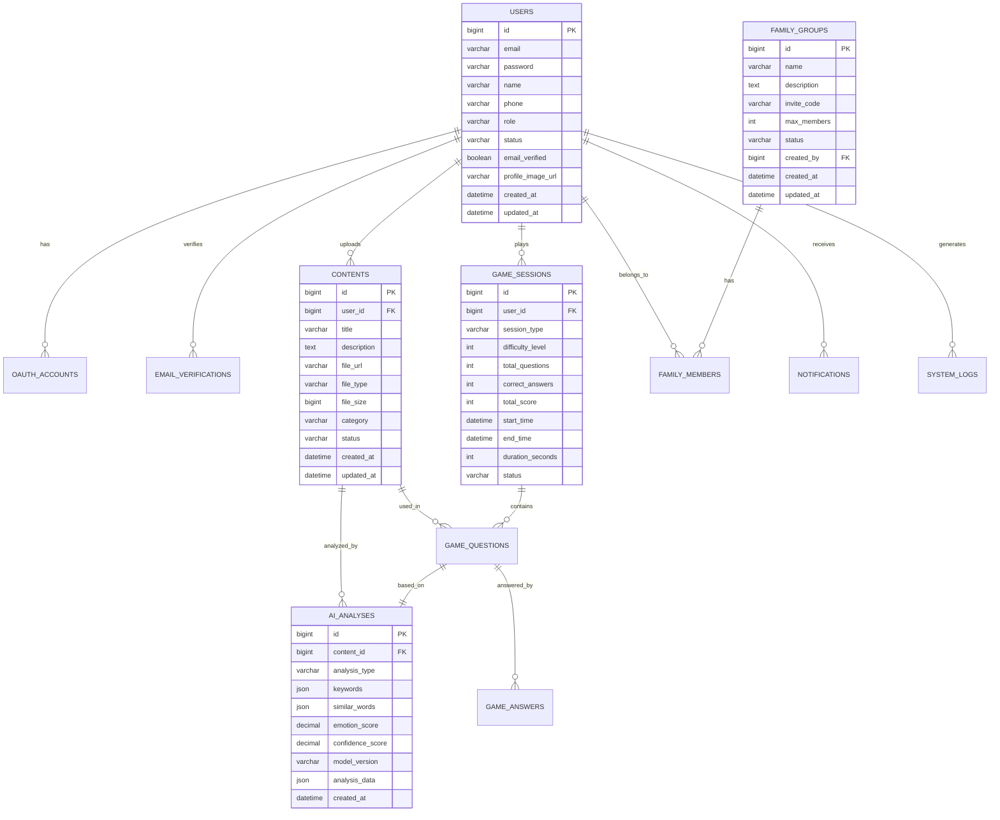

# 📄 **ERD 설계서 (Entity Relationship Diagram)**

> **프로젝트명**: Memory Forest - AI 기반 치매 케어 인지 훈련 플랫폼
> 
> **작성일**: 2025.01.15
> 
> **작성자**: 데이터베이스 설계자

---

## 📋 1. 데이터베이스 개요

### **1.1 데이터베이스 정보**
- **DBMS**: MySQL 8.0
- **문자셋**: UTF-8
- **정렬규칙**: utf8mb4_unicode_ci
- **엔진**: InnoDB

### **1.2 주요 특징**
- **사용자 관리**: OAuth2, JWT, 이메일 인증 지원
- **AI 분석**: 이미지, 텍스트, 감정 분석 결과 저장
- **게임 시스템**: 게임 세션, 결과, 점수 관리
- **가족 공유**: 가족 그룹, 권한, 알림 관리
- **콘텐츠 관리**: 이미지, 메타데이터, AI 분석 결과

---

## 🗂️ 2. 테이블 정의서

### **2.1 사용자 관련 테이블**

#### **📌 `users` 테이블**

| 컬럼명 | 자료형 | PK | FK | NULL 허용 | 기본값 | 설명 |
| --- | --- | --- | --- | --- | --- | --- |
| `id` | BIGINT | ✅ |  | ❌ | auto | 사용자 고유 번호 |
| `email` | VARCHAR(100) |  |  | ❌ |  | 이메일 주소 (유니크) |
| `password` | VARCHAR(255) |  |  | ✅ | null | 비밀번호 (OAuth 사용자 제외) |
| `name` | VARCHAR(50) |  |  | ❌ |  | 사용자 이름 |
| `phone` | VARCHAR(20) |  |  | ✅ | null | 전화번호 |
| `role` | VARCHAR(20) |  |  | ❌ | 'USER' | 사용자 권한 (USER, FAMILY, ADMIN) |
| `status` | VARCHAR(20) |  |  | ❌ | 'ACTIVE' | 계정 상태 (ACTIVE, INACTIVE, SUSPENDED) |
| `email_verified` | BOOLEAN |  |  | ❌ | false | 이메일 인증 완료 여부 |
| `profile_image_url` | VARCHAR(500) |  |  | ✅ | null | 프로필 이미지 URL |
| `created_at` | DATETIME |  |  | ❌ | now() | 가입일시 |
| `updated_at` | DATETIME |  |  | ❌ | now() | 수정일시 |

#### **📌 `oauth_accounts` 테이블**

| 컬럼명 | 자료형 | PK | FK | NULL 허용 | 기본값 | 설명 |
| --- | --- | --- | --- | --- | --- | --- |
| `id` | BIGINT | ✅ |  | ❌ | auto | OAuth 계정 고유 번호 |
| `user_id` | BIGINT |  | ✅ | ❌ |  | 사용자 ID (users.id) |
| `provider` | VARCHAR(20) |  |  | ❌ |  | OAuth 제공자 (NAVER, GOOGLE) |
| `provider_user_id` | VARCHAR(100) |  |  | ❌ |  | OAuth 제공자의 사용자 ID |
| `access_token` | VARCHAR(500) |  |  | ✅ | null | 액세스 토큰 |
| `refresh_token` | VARCHAR(500) |  |  | ✅ | null | 리프레시 토큰 |
| `expires_at` | DATETIME |  |  | ✅ | null | 토큰 만료일시 |
| `created_at` | DATETIME |  |  | ❌ | now() | 생성일시 |
| `updated_at` | DATETIME |  |  | ❌ | now() | 수정일시 |

#### **📌 `email_verifications` 테이블**

| 컬럼명 | 자료형 | PK | FK | NULL 허용 | 기본값 | 설명 |
| --- | --- | --- | --- | --- | --- | --- |
| `id` | BIGINT | ✅ |  | ❌ | auto | 인증 고유 번호 |
| `user_id` | BIGINT |  | ✅ | ❌ |  | 사용자 ID (users.id) |
| `verification_code` | VARCHAR(10) |  |  | ❌ |  | 인증 코드 |
| `expires_at` | DATETIME |  |  | ❌ |  | 만료일시 |
| `verified_at` | DATETIME |  |  | ✅ | null | 인증 완료일시 |
| `created_at` | DATETIME |  |  | ❌ | now() | 생성일시 |

### **2.2 AI 분석 관련 테이블**

#### **📌 `contents` 테이블**

| 컬럼명 | 자료형 | PK | FK | NULL 허용 | 기본값 | 설명 |
| --- | --- | --- | --- | --- | --- | --- |
| `id` | BIGINT | ✅ |  | ❌ | auto | 콘텐츠 고유 번호 |
| `user_id` | BIGINT |  | ✅ | ❌ |  | 업로드 사용자 ID (users.id) |
| `title` | VARCHAR(200) |  |  | ❌ |  | 콘텐츠 제목 |
| `description` | TEXT |  |  | ✅ | null | 콘텐츠 설명 |
| `file_url` | VARCHAR(500) |  |  | ❌ |  | 파일 URL (AWS S3) |
| `file_type` | VARCHAR(20) |  |  | ❌ |  | 파일 타입 (IMAGE, VIDEO) |
| `file_size` | BIGINT |  |  | ❌ |  | 파일 크기 (bytes) |
| `category` | VARCHAR(50) |  |  | ✅ | null | 카테고리 |
| `status` | VARCHAR(20) |  |  | ❌ | 'PENDING' | 상태 (PENDING, ANALYZED, APPROVED, REJECTED) |
| `created_at` | DATETIME |  |  | ❌ | now() | 업로드일시 |
| `updated_at` | DATETIME |  |  | ❌ | now() | 수정일시 |

#### **📌 `ai_analyses` 테이블**

| 컬럼명 | 자료형 | PK | FK | NULL 허용 | 기본값 | 설명 |
| --- | --- | --- | --- | --- | --- | --- |
| `id` | BIGINT | ✅ |  | ❌ | auto | AI 분석 고유 번호 |
| `content_id` | BIGINT |  | ✅ | ❌ |  | 콘텐츠 ID (contents.id) |
| `analysis_type` | VARCHAR(20) |  |  | ❌ |  | 분석 타입 (IMAGE, TEXT, EMOTION) |
| `keywords` | JSON |  |  | ✅ | null | 추출된 키워드 (JSON 배열) |
| `similar_words` | JSON |  |  | ✅ | null | 유사한 단어들 (JSON 배열) |
| `emotion_score` | DECIMAL(3,2) |  |  | ✅ | null | 감정 점수 (-1.0 ~ 1.0) |
| `confidence_score` | DECIMAL(3,2) |  |  | ❌ | 0.00 | 분석 신뢰도 (0.0 ~ 1.0) |
| `model_version` | VARCHAR(20) |  |  | ❌ |  | 사용된 AI 모델 버전 |
| `analysis_data` | JSON |  |  | ✅ | null | 상세 분석 결과 (JSON) |
| `created_at` | DATETIME |  |  | ❌ | now() | 분석일시 |

### **2.3 게임 시스템 관련 테이블**

#### **📌 `game_sessions` 테이블**

| 컬럼명 | 자료형 | PK | FK | NULL 허용 | 기본값 | 설명 |
| --- | --- | --- | --- | --- | --- | --- |
| `id` | BIGINT | ✅ |  | ❌ | auto | 게임 세션 고유 번호 |
| `user_id` | BIGINT |  | ✅ | ❌ |  | 사용자 ID (users.id) |
| `session_type` | VARCHAR(20) |  |  | ❌ | 'STANDARD' | 세션 타입 (STANDARD, PRACTICE, CHALLENGE) |
| `difficulty_level` | INT |  |  | ❌ | 1 | 난이도 레벨 (1-5) |
| `total_questions` | INT |  |  | ❌ | 10 | 총 문제 수 |
| `correct_answers` | INT |  |  | ❌ | 0 | 정답 수 |
| `total_score` | INT |  |  | ❌ | 0 | 총 점수 |
| `start_time` | DATETIME |  |  | ❌ | now() | 시작일시 |
| `end_time` | DATETIME |  |  | ✅ | null | 종료일시 |
| `duration_seconds` | INT |  |  | ✅ | null | 소요시간 (초) |
| `status` | VARCHAR(20) |  |  | ❌ | 'ACTIVE' | 상태 (ACTIVE, COMPLETED, PAUSED) |

#### **📌 `game_questions` 테이블**

| 컬럼명 | 자료형 | PK | FK | NULL 허용 | 기본값 | 설명 |
| --- | --- | --- | --- | --- | --- | --- |
| `id` | BIGINT | ✅ |  | ❌ | auto | 문제 고유 번호 |
| `session_id` | BIGINT |  | ✅ | ❌ |  | 게임 세션 ID (game_sessions.id) |
| `content_id` | BIGINT |  | ✅ | ❌ |  | 콘텐츠 ID (contents.id) |
| `question_type` | VARCHAR(20) |  |  | ❌ | 'MATCHING' | 문제 타입 (MATCHING, MULTIPLE_CHOICE) |
| `question_text` | VARCHAR(500) |  |  | ❌ |  | 문제 텍스트 |
| `correct_answer` | VARCHAR(200) |  |  | ❌ |  | 정답 |
| `options` | JSON |  |  | ❌ |  | 선택지 (JSON 배열) |
| `difficulty_score` | DECIMAL(3,2) |  |  | ❌ | 1.00 | 난이도 점수 (0.0 ~ 5.0) |
| `ai_analysis_id` | BIGINT |  | ✅ | ✅ | null | AI 분석 ID (ai_analyses.id) |
| `created_at` | DATETIME |  |  | ❌ | now() | 생성일시 |

#### **📌 `game_answers` 테이블**

| 컬럼명 | 자료형 | PK | FK | NULL 허용 | 기본값 | 설명 |
| --- | --- | --- | --- | --- | --- | --- |
| `id` | BIGINT | ✅ |  | ❌ | auto | 답변 고유 번호 |
| `question_id` | BIGINT |  | ✅ | ❌ |  | 문제 ID (game_questions.id) |
| `user_answer` | VARCHAR(200) |  |  | ❌ |  | 사용자 답변 |
| `is_correct` | BOOLEAN |  |  | ❌ |  | 정답 여부 |
| `response_time_ms` | INT |  |  | ❌ |  | 응답시간 (밀리초) |
| `score` | INT |  |  | ❌ | 0 | 획득 점수 |
| `confidence_level` | DECIMAL(3,2) |  |  | ✅ | null | 사용자 확신도 (0.0 ~ 1.0) |
| `answered_at` | DATETIME |  |  | ❌ | now() | 답변일시 |

### **2.4 가족 공유 관련 테이블**

#### **📌 `family_groups` 테이블**

| 컬럼명 | 자료형 | PK | FK | NULL 허용 | 기본값 | 설명 |
| --- | --- | --- | --- | --- | --- | --- |
| `id` | BIGINT | ✅ |  | ❌ | auto | 가족 그룹 고유 번호 |
| `name` | VARCHAR(100) |  |  | ❌ |  | 그룹 이름 |
| `description` | TEXT |  |  | ✅ | null | 그룹 설명 |
| `invite_code` | VARCHAR(20) |  |  | ❌ |  | 초대 코드 (유니크) |
| `max_members` | INT |  |  | ❌ | 10 | 최대 멤버 수 |
| `status` | VARCHAR(20) |  |  | ❌ | 'ACTIVE' | 상태 (ACTIVE, INACTIVE) |
| `created_by` | BIGINT |  | ✅ | ❌ |  | 생성자 ID (users.id) |
| `created_at` | DATETIME |  |  | ❌ | now() | 생성일시 |
| `updated_at` | DATETIME |  |  | ❌ | now() | 수정일시 |

#### **📌 `family_members` 테이블**

| 컬럼명 | 자료형 | PK | FK | NULL 허용 | 기본값 | 설명 |
| --- | --- | --- | --- | --- | --- | --- |
| `id` | BIGINT | ✅ |  | ❌ | auto | 가족 멤버 고유 번호 |
| `group_id` | BIGINT |  | ✅ | ❌ |  | 가족 그룹 ID (family_groups.id) |
| `user_id` | BIGINT |  | ✅ | ❌ |  | 사용자 ID (users.id) |
| `role` | VARCHAR(20) |  |  | ❌ | 'MEMBER' | 역할 (ADMIN, MEMBER, VIEWER) |
| `relationship` | VARCHAR(50) |  |  | ✅ | null | 관계 (배우자, 자녀, 부모 등) |
| `joined_at` | DATETIME |  |  | ❌ | now() | 가입일시 |
| `status` | VARCHAR(20) |  |  | ❌ | 'ACTIVE' | 상태 (ACTIVE, INACTIVE, PENDING) |

#### **📌 `notifications` 테이블**

| 컬럼명 | 자료형 | PK | FK | NULL 허용 | 기본값 | 설명 |
| --- | --- | --- | --- | --- | --- | --- |
| `id` | BIGINT | ✅ |  | ❌ | auto | 알림 고유 번호 |
| `user_id` | BIGINT |  | ✅ | ❌ |  | 수신자 ID (users.id) |
| `type` | VARCHAR(20) |  |  | ❌ |  | 알림 타입 (GAME_COMPLETE, PROGRESS_UPDATE, SYSTEM) |
| `title` | VARCHAR(200) |  |  | ❌ |  | 알림 제목 |
| `message` | TEXT |  |  | ❌ |  | 알림 내용 |
| `data` | JSON |  |  | ✅ | null | 추가 데이터 (JSON) |
| `is_read` | BOOLEAN |  |  | ❌ | false | 읽음 여부 |
| `read_at` | DATETIME |  |  | ✅ | null | 읽음일시 |
| `created_at` | DATETIME |  |  | ❌ | now() | 생성일시 |

### **2.5 시스템 관리 관련 테이블**

#### **📌 `system_logs` 테이블**

| 컬럼명 | 자료형 | PK | FK | NULL 허용 | 기본값 | 설명 |
| --- | --- | --- | --- | --- | --- | --- |
| `id` | BIGINT | ✅ |  | ❌ | auto | 로그 고유 번호 |
| `level` | VARCHAR(10) |  |  | ❌ | 'INFO' | 로그 레벨 (DEBUG, INFO, WARN, ERROR) |
| `category` | VARCHAR(50) |  |  | ❌ |  | 로그 카테고리 |
| `message` | TEXT |  |  | ❌ |  | 로그 메시지 |
| `user_id` | BIGINT |  | ✅ | ✅ | null | 관련 사용자 ID (users.id) |
| `ip_address` | VARCHAR(45) |  |  | ✅ | null | IP 주소 |
| `user_agent` | TEXT |  |  | ✅ | null | 사용자 에이전트 |
| `request_data` | JSON |  |  | ✅ | null | 요청 데이터 (JSON) |
| `created_at` | DATETIME |  |  | ❌ | now() | 생성일시 |

---

## 🔗 3. 개체-관계도(ERD)

---

## 📊 4. 인덱스 설계

### **4.1 주요 인덱스**

| 테이블명 | 인덱스명 | 컬럼 | 타입 | 설명 |
| --- | --- | --- | --- | --- |
| `users` | `idx_users_email` | `email` | UNIQUE | 이메일 중복 방지 |
| `users` | `idx_users_status` | `status` | BTREE | 계정 상태별 조회 |
| `contents` | `idx_contents_user_id` | `user_id` | BTREE | 사용자별 콘텐츠 조회 |
| `contents` | `idx_contents_status` | `status` | BTREE | 상태별 콘텐츠 조회 |
| `game_sessions` | `idx_game_sessions_user_id` | `user_id` | BTREE | 사용자별 게임 세션 |
| `game_sessions` | `idx_game_sessions_created_at` | `created_at` | BTREE | 날짜별 게임 세션 |
| `ai_analyses` | `idx_ai_analyses_content_id` | `content_id` | BTREE | 콘텐츠별 AI 분석 |
| `family_members` | `idx_family_members_group_id` | `group_id` | BTREE | 그룹별 멤버 조회 |
| `notifications` | `idx_notifications_user_id` | `user_id` | BTREE | 사용자별 알림 |
| `notifications` | `idx_notifications_created_at` | `created_at` | BTREE | 날짜별 알림 |

---

## 🔒 5. 보안 및 권한

### **5.1 데이터베이스 사용자 권한**

| 사용자 | 권한 | 설명 |
| --- | --- | --- |
| `memory_forest_app` | SELECT, INSERT, UPDATE, DELETE | 애플리케이션 전용 사용자 |
| `memory_forest_readonly` | SELECT | 읽기 전용 사용자 (백업, 모니터링) |
| `memory_forest_admin` | ALL PRIVILEGES | 관리자 사용자 |

### **5.2 데이터 암호화**

- **민감 정보**: 비밀번호는 BCrypt 해시, 개인정보는 AES-256 암호화
- **전송 보안**: TLS 1.3 적용
- **저장 보안**: 데이터베이스 레벨 암호화 (MySQL Enterprise)

---

## 📈 6. 성능 최적화

### **6.1 쿼리 최적화**
- 복잡한 조인 쿼리는 뷰(View) 생성
- 자주 사용되는 집계 쿼리는 Materialized View 고려
- 파티셔닝: `game_sessions`, `system_logs` 테이블은 날짜별 파티셔닝

### **6.2 캐싱 전략**
- Redis를 활용한 세션 및 자주 조회되는 데이터 캐싱
- AI 분석 결과 캐싱으로 중복 분석 방지
- 게임 통계 데이터 캐싱으로 응답 속도 향상

---

**문서 정보**
- 작성일: 2025년 1월 15일
- 버전: v1.0
- 작성자: 데이터베이스 설계자
- 검토자: 백엔드 개발자
- 승인자: 기술 책임자
