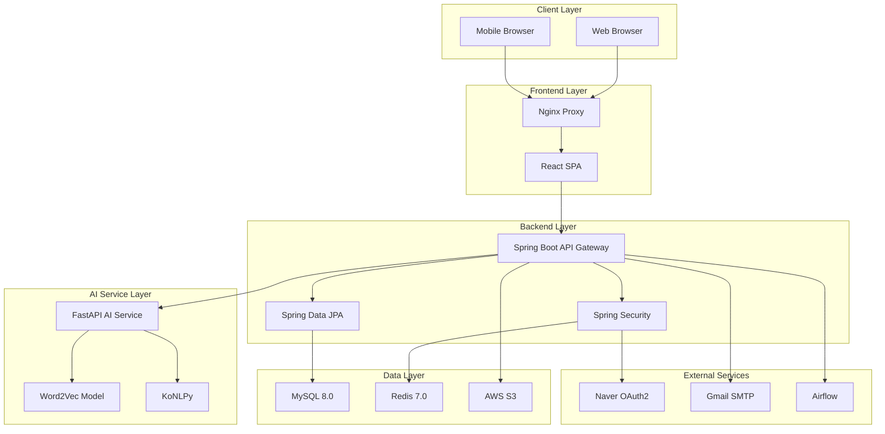
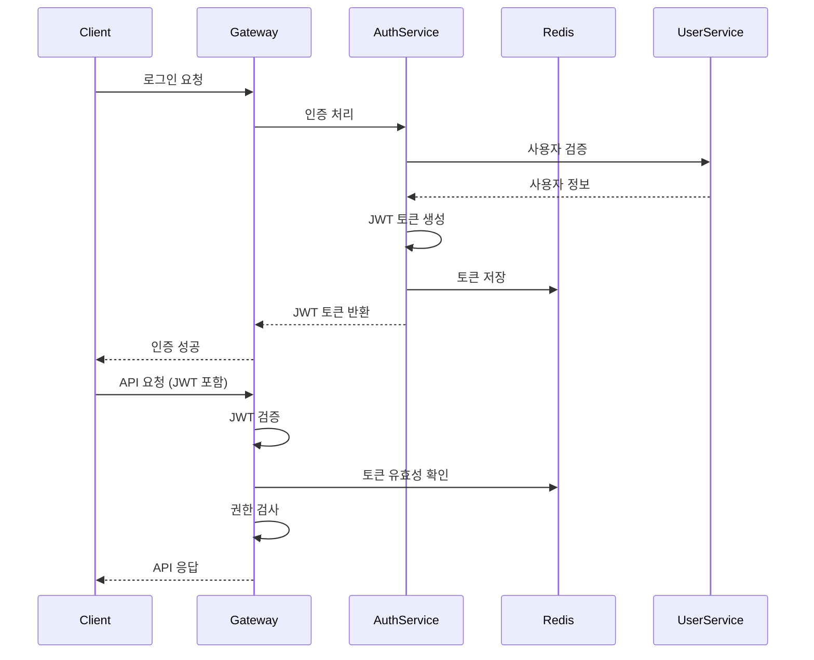
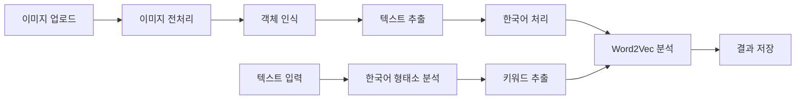
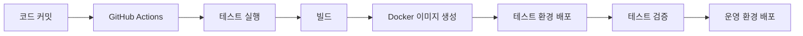

# 📄 **시스템 아키텍처 (System Architecture)**

> **프로젝트명**: Memory Forest - AI 기반 치매 케어 인지 훈련 플랫폼
> 
> **작성일**: 2025.01.15
> 
> **작성자**: 시스템 아키텍트

---

## 🏗️ 1. 전체 시스템 아키텍처

### **1.1 시스템 개요**
Memory Forest는 마이크로서비스 아키텍처를 기반으로 한 AI 기반 치매 케어 플랫폼입니다. Spring Boot 백엔드, React 프론트엔드, FastAPI AI 서비스로 구성되어 있으며, Docker 컨테이너로 배포됩니다.

### **1.2 전체 시스템 구성도**



---

## 🔧 2. 기술 스택

### **2.1 Backend 기술 스택**

| 기술 | 버전 | 용도 | 특징 |
| --- | --- | --- | --- |
| **Java** | 21 | 메인 개발 언어 | 최신 LTS 버전, 성능 향상 |
| **Spring Boot** | 3.5.4 | 웹 프레임워크 | 최신 Spring 6 기반 |
| **Spring Security** | 6.x | 보안 프레임워크 | OAuth2, JWT 지원 |
| **Spring Data JPA** | 3.x | 데이터 접근 | Hibernate 기반 ORM |
| **Spring Session** | 3.x | 세션 관리 | Redis 기반 세션 저장 |
| **Gradle** | 8.x | 빌드 도구 | Kotlin DSL 지원 |

### **2.2 Frontend 기술 스택**

| 기술 | 버전 | 용도 | 특징 |
| --- | --- | --- | --- |
| **React** | 19.1.0 | UI 프레임워크 | 최신 React 19, Concurrent Features |
| **Vite** | 7.0.4 | 빌드 도구 | 빠른 개발 서버, HMR |
| **Bootstrap** | 5.3.7 | CSS 프레임워크 | 반응형, 접근성 지원 |
| **ApexCharts** | 4.0.0 | 차트 라이브러리 | 인터랙티브 차트 |
| **React Router** | 7.7.0 | 라우팅 | 최신 라우터 v7 |

### **2.3 AI Service 기술 스택**

| 기술 | 버전 | 용도 | 특징 |
| --- | --- | --- | --- |
| **Python** | 3.10+ | AI 서비스 언어 | 안정적인 버전 |
| **FastAPI** | 0.111.0 | 웹 프레임워크 | 비동기, 자동 문서화 |
| **Uvicorn** | 0.29.0 | ASGI 서버 | 고성능 비동기 서버 |
| **Word2Vec** | 4.3.2 | 자연어 처리 | Gensim 기반 |
| **KoNLPy** | 0.6.0 | 한국어 처리 | 한국어 형태소 분석 |
| **scikit-learn** | 1.3.2 | 머신러닝 | 텍스트 분류, 감정 분석 |

### **2.4 Infrastructure 기술 스택**

| 기술 | 버전 | 용도 | 특징 |
| --- | --- | --- | --- |
| **Docker** | 24.x | 컨테이너화 | 애플리케이션 패키징 |
| **Docker Compose** | 2.x | 오케스트레이션 | 다중 서비스 관리 |
| **MySQL** | 8.0 | 관계형 데이터베이스 | ACID 트랜잭션 |
| **Redis** | 7.0 | 인메모리 데이터베이스 | 세션, 캐시 저장 |
| **Nginx** | 1.24+ | 웹 서버/프록시 | 정적 파일 서빙, 로드 밸런싱 |

---

## 🏛️ 3. 아키텍처 패턴

### **3.1 레이어드 아키텍처 (Backend)**

```
┌─────────────────────────────────────┐
│           Controller Layer          │ ← REST API 엔드포인트
├─────────────────────────────────────┤
│           Service Layer             │ ← 비즈니스 로직
├─────────────────────────────────────┤
│         Repository Layer            │ ← 데이터 접근
├─────────────────────────────────────┤
│           Domain Layer              │ ← 엔티티, DTO
└─────────────────────────────────────┘
```

#### **Controller Layer**
- REST API 엔드포인트 제공
- 요청/응답 데이터 검증
- 인증/인가 처리
- 예외 처리 및 에러 응답

#### **Service Layer**
- 비즈니스 로직 구현
- 트랜잭션 관리
- 외부 서비스 연동
- 데이터 변환 및 가공

#### **Repository Layer**
- 데이터베이스 접근
- JPA 엔티티 관리
- 쿼리 최적화
- 데이터 캐싱

#### **Domain Layer**
- 엔티티 정의
- DTO 클래스
- 도메인 서비스
- 값 객체

### **3.2 마이크로서비스 아키텍처**

```
┌─────────────────────────────────────┐
│        API Gateway                 │
│     (Spring Boot)                  │
├─────────────────────────────────────┤
│  ┌─────────────┐  ┌─────────────┐  │
│  │   Auth      │  │   User      │  │
│  │  Service    │  │  Service    │  │
│  └─────────────┘  └─────────────┘  │
│  ┌─────────────┐  ┌─────────────┐  │
│  │   Game      │  │   Content   │  │
│  │  Service    │  │  Service    │  │
│  └─────────────┘  └─────────────┘  │
│  ┌─────────────┐  ┌─────────────┐  │
│  │   Family    │  │   Progress  │  │
│  │  Service    │  │  Service    │  │
│  └─────────────┘  └─────────────┘  │
├─────────────────────────────────────┤
│        AI Service                  │
│       (FastAPI)                    │
└─────────────────────────────────────┘
```

---

## 🔐 4. 보안 아키텍처

### **4.1 인증 및 인가 시스템**



### **4.2 OAuth2 인증 플로우**

```
┌─────────────┐    ┌─────────────┐    ┌─────────────┐
│   Client    │    │   Naver     │    │   Backend   │
│             │    │   OAuth     │    │             │
└─────────────┘    └─────────────┘    └─────────────┘
       │                   │                   │
       │ 1. OAuth 요청     │                   │
       │─────────────────>│                   │
       │                   │                   │
       │ 2. 인증 페이지    │                   │
       │<─────────────────│                   │
       │                   │                   │
       │ 3. 사용자 인증    │                   │
       │─────────────────>│                   │
       │                   │                   │
       │ 4. 인증 코드      │                   │
       │<─────────────────│                   │
       │                   │                   │
       │ 5. 토큰 교환      │                   │
       │──────────────────────────────────────>│
       │                   │                   │
       │ 6. 사용자 정보    │                   │
       │<──────────────────────────────────────│
       │                   │                   │
       │ 7. JWT 발급       │                   │
       │<──────────────────────────────────────│
```

---

## 🗄️ 5. 데이터 아키텍처

### **5.1 데이터 저장소 구조**

```
┌─────────────────────────────────────┐
│           Application Layer         │
├─────────────────────────────────────┤
│         Spring Data JPA             │
├─────────────────────────────────────┤
│           Hibernate ORM             │
├─────────────────────────────────────┤
│         MySQL 8.0 Database          │
│                                     │
│  ┌─────────────┐  ┌─────────────┐  │
│  │   Users     │  │  Contents   │  │
│  │   Table     │  │   Table     │  │
│  └─────────────┘  └─────────────┘  │
│  ┌─────────────┐  ┌─────────────┐  │
│  │   Games     │  │   Family    │  │
│  │   Table     │  │   Table     │  │
│  └─────────────┘  └─────────────┘  │
└─────────────────────────────────────┘
```

### **5.2 캐싱 전략**

```
┌─────────────────────────────────────┐
│           Application Layer         │
├─────────────────────────────────────┤
│         Cache Layer                 │
│  ┌─────────────┐  ┌─────────────┐  │
│  │   Redis     │  │   Local     │  │
│  │   Cache     │  │   Cache     │  │
│  └─────────────┘  └─────────────┘  │
├─────────────────────────────────────┤
│         Database Layer              │
└─────────────────────────────────────┘
```

#### **Redis 캐시 사용 사례**
- **세션 저장**: 사용자 로그인 세션
- **토큰 저장**: JWT 토큰 블랙리스트
- **게임 데이터**: 자주 조회되는 게임 통계
- **AI 분석 결과**: 이미지 분석 결과 캐싱

---

## 🤖 6. AI 서비스 아키텍처

### **6.1 AI 분석 파이프라인**



### **6.2 AI 모델 구조**

```
┌─────────────────────────────────────┐
│        FastAPI Application          │
├─────────────────────────────────────┤
│         AI Service Layer            │
│  ┌─────────────┐  ┌─────────────┐  │
│  │  Image      │  │  Text       │  │
│  │ Analysis    │  │ Analysis    │  │
│  └─────────────┘  └─────────────┘  │
├─────────────────────────────────────┤
│         Model Layer                 │
│  ┌─────────────┐  ┌─────────────┐  │
│  │ Word2Vec    │  │ KoNLPy      │  │
│  │ Model       │  │ Models      │  │
│  └─────────────┘  └─────────────┘  │
└─────────────────────────────────────┘
```

---

## 🚀 7. 배포 아키텍처

### **7.1 Docker 컨테이너 구조**

```yaml
version: "3.8"
services:
  # 데이터베이스
  mysql-db:
    image: mysql:8.0
    environment:
      MYSQL_ROOT_PASSWORD: mysql
      MYSQL_DATABASE: memory_forest
    
  # Redis 캐시
  redis:
    image: redis:7-alpine
    
  # AI 서비스
  ai-service:
    build: ./ai
    ports:
      - "8000:8000"
    
  # Spring Boot 백엔드
  backend:
    build: ./backend
    ports:
      - "8080:8080"
    
  # React 프론트엔드
  frontend:
    build: ./frontend
    ports:
      - "3000:3000"
    
  # Nginx 프록시
  nginx:
    image: nginx:stable-alpine
    ports:
      - "80:80"
      - "443:443"
```

### **7.2 네트워크 구조**

```
┌─────────────────────────────────────┐
│           Internet                  │
└─────────────────┬───────────────────┘
                  │
┌─────────────────▼───────────────────┐
│           Nginx (80/443)            │
└─────────────────┬───────────────────┘
                  │
        ┌─────────┴─────────┐
        │                   │
┌───────▼──────┐  ┌─────────▼─────────┐
│  Frontend    │  │     Backend       │
│  (3000)      │  │     (8080)        │
└──────────────┘  └───────────────────┘
                          │
        ┌─────────────────┴─────────────────┐
        │                                   │
┌───────▼──────┐  ┌─────────▼─────────┐    │
│  AI Service  │  │      MySQL        │    │
│   (8000)     │  │      (3306)       │    │
└──────────────┘  └───────────────────┘    │
                                            │
                                    ┌───────▼──────┐
                                    │    Redis     │
                                    │    (6379)    │
                                    └──────────────┘
```

---

## 📊 8. 성능 및 확장성

### **8.1 성능 최적화 전략**

#### **백엔드 최적화**
- **Connection Pooling**: HikariCP를 통한 데이터베이스 연결 최적화
- **캐싱**: Redis를 활용한 세션 및 데이터 캐싱
- **비동기 처리**: Spring Async를 통한 AI 분석 비동기 처리
- **JPA 최적화**: N+1 문제 방지, 배치 처리

#### **프론트엔드 최적화**
- **코드 스플리팅**: React.lazy를 통한 지연 로딩
- **이미지 최적화**: WebP 포맷, 적응형 이미지
- **번들 최적화**: Tree shaking, 코드 분할
- **캐싱**: Service Worker를 통한 오프라인 지원

#### **AI 서비스 최적화**
- **모델 캐싱**: Word2Vec 모델 메모리 로딩
- **배치 처리**: 여러 이미지 동시 분석
- **비동기 처리**: FastAPI 비동기 엔드포인트
- **로드 밸런싱**: 다중 AI 서비스 인스턴스

### **8.2 확장성 전략**

#### **수평적 확장**
- **로드 밸런서**: Nginx를 통한 트래픽 분산
- **마이크로서비스**: 독립적인 서비스 확장
- **데이터베이스**: Master-Slave 복제, 샤딩
- **캐시**: Redis Cluster 구성

#### **수직적 확장**
- **컨테이너 리소스**: CPU, 메모리 할당 증가
- **JVM 튜닝**: 힙 메모리, GC 최적화
- **데이터베이스**: 인덱스 최적화, 쿼리 튜닝

---

## 🔍 9. 모니터링 및 로깅

### **9.1 모니터링 시스템**

```
┌─────────────────────────────────────┐
│        Application Metrics           │
│  ┌─────────────┐  ┌─────────────┐  │
│  │   Spring    │  │   Custom    │  │
│  │   Boot      │  │   Metrics   │  │
│  │   Actuator  │  │             │  │
│  └─────────────┘  └─────────────┘  │
├─────────────────────────────────────┤
│         Monitoring Tools            │
│  ┌─────────────┐  ┌─────────────┐  │
│  │   Prometheus│  │   Grafana   │  │
│  │             │  │             │  │
│  └─────────────┘  └─────────────┘  │
└─────────────────────────────────────┘
```

### **9.2 로깅 전략**

#### **로그 레벨**
- **DEBUG**: 개발 시 상세 정보
- **INFO**: 일반적인 정보
- **WARN**: 경고 상황
- **ERROR**: 오류 상황

#### **로그 구조**
```json
{
  "timestamp": "2025-01-15T10:30:00Z",
  "level": "INFO",
  "service": "memory-forest-backend",
  "traceId": "abc123",
  "userId": "123",
  "message": "게임 세션이 시작되었습니다.",
  "metadata": {
    "sessionId": "101",
    "difficulty": "2"
  }
}
```

---

## 🛡️ 10. 보안 고려사항

### **10.1 데이터 보안**
- **암호화**: AES-256 (저장), TLS 1.3 (전송)
- **해싱**: BCrypt를 통한 비밀번호 암호화
- **토큰**: JWT 서명 검증, 만료 시간 관리
- **세션**: Redis 기반 세션 관리

### **10.2 접근 제어**
- **RBAC**: 역할 기반 접근 제어
- **API 보안**: Rate Limiting, CORS 설정
- **입력 검증**: XSS, SQL Injection 방지
- **파일 업로드**: 파일 타입 검증, 바이러스 스캔

---

## 🔄 11. CI/CD 파이프라인

### **11.1 배포 파이프라인**



### **11.2 환경별 배포**
- **개발 환경**: 개발자 로컬 환경
- **테스트 환경**: Docker Compose 기반 통합 테스트
- **스테이징 환경**: 운영 환경과 유사한 구성
- **운영 환경**: 프로덕션 서버 배포

---

**문서 정보**
- 작성일: 2025년 1월 15일
- 버전: v1.0
- 작성자: 시스템 아키텍트
- 검토자: 백엔드 개발자
- 승인자: 기술 책임자
