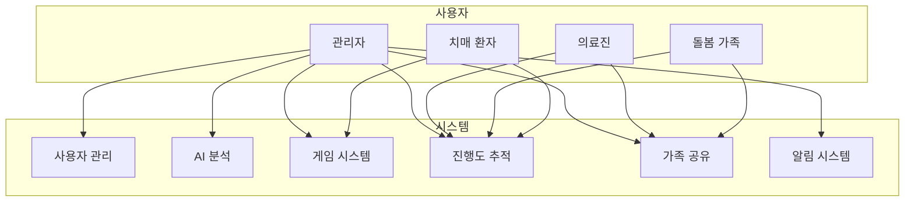

# 📋 **유스케이스 명세서 (Use Case Specification)**

> **프로젝트명**: Memory Forest - AI 기반 치매 케어 인지 훈련 플랫폼
> 
> **작성일**: 2025.01.15
> 
> **작성자**: 시스템 분석가

---

## 📋 1. 유스케이스 개요

### **1.1 문서 목적**
이 문서는 Memory Forest 시스템의 주요 기능들을 유스케이스 관점에서 분석하고 명세하여, 개발팀과 이해관계자들이 시스템의 기능과 동작을 명확히 이해할 수 있도록 합니다.

### **1.2 유스케이스 다이어그램 개요**

---

## 👤 2. 액터 정의

### **2.1 주요 액터**

| 액터 ID | 액터명 | 설명 | 역할 |
| --- | --- | --- | --- |
| **UC-ACT-001** | 치매 환자 | 60세 이상, 경도인지장애~치매 중기 환자 | 게임 플레이, 진행도 확인 |
| **UC-ACT-002** | 돌봄 가족 | 환자의 자녀 또는 배우자 | 환자 모니터링, 가족 그룹 관리 |
| **UC-ACT-003** | 의료진 | 신경과 의사, 간호사, 요양보호사 | 환자 상태 분석, 의료 리포트 확인 |
| **UC-ACT-004** | 관리자 | 시스템 관리자 | 사용자 관리, 시스템 모니터링 |

### **2.2 보조 액터**

| 액터 ID | 액터명 | 설명 | 역할 |
| --- | --- | --- | --- |
| **UC-ACT-005** | AI 분석 시스템 | FastAPI 기반 AI 서비스 | 이미지/텍스트 분석, 키워드 추출 |
| **UC-ACT-006** | 이메일 시스템 | Gmail SMTP 서비스 | 인증 메일, 알림 메일 발송 |
| **UC-ACT-007** | OAuth2 제공자 | Naver OAuth2 서비스 | 소셜 로그인 인증 |
| **UC-ACT-008** | 파일 저장소 | AWS S3 서비스 | 이미지 파일 저장 및 관리 |

---

## 🎯 3. 유스케이스 목록

### **3.1 사용자 관리 유스케이스**

| 유스케이스 ID | 유스케이스명 | 우선순위 | 복잡도 | 액터 |
| --- | --- | --- | --- | --- |
| **UC-001** | 회원가입 | 높음 | 중간 | 치매 환자, 돌봄 가족 |
| **UC-002** | 로그인 | 높음 | 낮음 | 모든 사용자 |
| **UC-003** | OAuth2 로그인 | 높음 | 중간 | 모든 사용자 |
| **UC-004** | 이메일 인증 | 높음 | 중간 | 치매 환자, 돌봄 가족 |
| **UC-005** | 프로필 관리 | 중간 | 낮음 | 모든 사용자 |
| **UC-006** | 비밀번호 변경 | 중간 | 낮음 | 모든 사용자 |

### **3.2 AI 분석 유스케이스**

| 유스케이스 ID | 유스케이스명 | 우선순위 | 복잡도 | 액터 |
| --- | --- | --- | --- | --- |
| **UC-007** | 이미지 업로드 및 분석 | 높음 | 높음 | 돌봄 가족, 관리자 |
| **UC-008** | 텍스트 분석 | 높음 | 중간 | 돌봄 가족, 관리자 |
| **UC-009** | 감정 분석 | 중간 | 중간 | 돌봄 가족, 관리자 |
| **UC-010** | 연관어 생성 | 중간 | 중간 | AI 분석 시스템 |

### **3.3 게임 시스템 유스케이스**

| 유스케이스 ID | 유스케이스명 | 우선순위 | 복잡도 | 액터 |
| --- | --- | --- | --- | --- |
| **UC-011** | 게임 세션 시작 | 높음 | 중간 | 치매 환자 |
| **UC-012** | 게임 플레이 | 높음 | 높음 | 치매 환자 |
| **UC-013** | 답변 제출 | 높음 | 낮음 | 치매 환자 |
| **UC-014** | 게임 결과 확인 | 높음 | 낮음 | 치매 환자 |
| **UC-015** | 적응형 난이도 조절 | 중간 | 높음 | 게임 시스템 |

### **3.4 진행도 추적 유스케이스**

| 유스케이스 ID | 유스케이스명 | 우선순위 | 복잡도 | 액터 |
| --- | --- | --- | --- | --- |
| **UC-016** | 진행도 대시보드 확인 | 높음 | 중간 | 모든 사용자 |
| **UC-017** | 통계 차트 조회 | 높음 | 중간 | 모든 사용자 |
| **UC-018** | 상세 리포트 생성 | 중간 | 높음 | 의료진, 돌봄 가족 |
| **UC-019** | 성과 분석 | 중간 | 높음 | 의료진, 돌봄 가족 |

### **3.5 가족 공유 유스케이스**

| 유스케이스 ID | 유스케이스명 | 우선순위 | 복잡도 | 액터 |
| --- | --- | --- | --- | --- |
| **UC-020** | 가족 그룹 생성 | 높음 | 중간 | 돌봄 가족 |
| **UC-021** | 가족 그룹 참여 | 높음 | 중간 | 돌봄 가족 |
| **UC-022** | 환자 진행도 모니터링 | 높음 | 중간 | 돌봄 가족 |
| **UC-023** | 가족 간 소통 | 중간 | 낮음 | 돌봄 가족 |

### **3.6 알림 시스템 유스케이스**

| 유스케이스 ID | 유스케이스명 | 우선순위 | 복잡도 | 액터 |
| --- | --- | --- | --- | --- |
| **UC-024** | 알림 수신 | 높음 | 낮음 | 모든 사용자 |
| **UC-025** | 알림 설정 관리 | 중간 | 중간 | 모든 사용자 |
| **UC-026** | 이메일 알림 발송 | 중간 | 중간 | 알림 시스템 |

---

## 📝 4. 상세 유스케이스 명세

### **4.1 UC-001: 회원가입**

#### **4.1.1 기본 정보**

| 항목 | 내용 |
| --- | --- |
| **유스케이스 ID** | UC-001 |
| **유스케이스명** | 회원가입 |
| **액터** | 치매 환자, 돌봄 가족 |
| **우선순위** | 높음 |
| **복잡도** | 중간 |

#### **4.1.2 개요**
사용자가 이메일과 비밀번호를 사용하여 새로운 계정을 생성합니다.

#### **4.1.3 사전 조건**
- 사용자가 회원가입 페이지에 접근
- 이메일 주소가 유효한 형식
- 비밀번호가 보안 요구사항 충족

#### **4.1.4 기본 흐름**

1. **사용자가 회원가입 페이지 접근**
   - 사용자가 회원가입 링크 클릭
   - 시스템이 회원가입 폼 표시

2. **사용자 정보 입력**
   - 사용자가 이메일 주소 입력
   - 사용자가 비밀번호 입력
   - 사용자가 이름 입력
   - 사용자가 전화번호 입력 (선택사항)

3. **정보 유효성 검사**
   - 시스템이 이메일 형식 검증
   - 시스템이 비밀번호 강도 검증
   - 시스템이 필수 필드 입력 여부 확인

4. **중복 이메일 확인**
   - 시스템이 데이터베이스에서 이메일 중복 확인
   - 중복되지 않은 경우 다음 단계 진행

5. **계정 생성**
   - 시스템이 사용자 정보를 데이터베이스에 저장
   - 시스템이 이메일 인증 코드 생성

6. **인증 이메일 발송**
   - 시스템이 인증 코드를 포함한 이메일 발송
   - 시스템이 회원가입 완료 메시지 표시

#### **4.1.5 대안 흐름**

**A1: 이메일 중복**
- 4단계에서 이메일이 중복된 경우
- 시스템이 "이미 존재하는 이메일입니다" 메시지 표시
- 2단계로 돌아가 다른 이메일 입력 유도

**A2: 유효성 검사 실패**
- 3단계에서 유효성 검사 실패 시
- 시스템이 해당 필드에 오류 메시지 표시
- 2단계로 돌아가 올바른 정보 입력 유도

#### **4.1.6 사후 조건**
- 새로운 사용자 계정이 데이터베이스에 생성됨
- 이메일 인증 코드가 발송됨
- 사용자가 이메일 인증 페이지로 이동 가능

#### **4.1.7 특별 요구사항**
- 비밀번호는 최소 8자, 영문/숫자/특수문자 조합
- 이메일 인증 완료 전까지 로그인 제한
- 개인정보보호법 준수

---

### **4.2 UC-011: 게임 세션 시작**

#### **4.2.1 기본 정보**

| 항목 | 내용 |
| --- | --- |
| **유스케이스 ID** | UC-011 |
| **유스케이스명** | 게임 세션 시작 |
| **액터** | 치매 환자 |
| **우선순위** | 높음 |
| **복잡도** | 중간 |

#### **4.2.2 개요**
치매 환자가 새로운 게임 세션을 시작하여 인지 훈련을 수행합니다.

#### **4.2.3 사전 조건**
- 사용자가 로그인된 상태
- 사용자 계정이 활성화된 상태
- AI 분석이 완료된 콘텐츠가 존재

#### **4.2.4 기본 흐름**

1. **게임 시작 요청**
   - 사용자가 메인 대시보드에서 "게임 시작" 버튼 클릭
   - 시스템이 게임 설정 페이지 표시

2. **게임 설정 선택**
   - 사용자가 게임 유형 선택 (표준/연습/도전)
   - 사용자가 난이도 레벨 선택 (1-5)
   - 사용자가 문제 수 선택 (5-20문제)

3. **게임 세션 생성**
   - 시스템이 새로운 게임 세션 생성
   - 시스템이 사용자 설정에 맞는 문제 생성
   - 시스템이 게임 세션 ID 발급

4. **문제 준비**
   - 시스템이 AI 분석 결과를 기반으로 문제 생성
   - 시스템이 선택지 4개 생성 (정답 1개, 오답 3개)
   - 시스템이 문제별 난이도 점수 계산

5. **게임 플레이 화면 표시**
   - 시스템이 첫 번째 문제와 선택지 표시
   - 시스템이 게임 타이머 시작
   - 시스템이 진행률 표시

#### **4.2.5 대안 흐름**

**A1: 콘텐츠 부족**
- 3단계에서 충분한 콘텐츠가 없는 경우
- 시스템이 "콘텐츠를 추가해주세요" 메시지 표시
- 콘텐츠 업로드 페이지로 이동 유도

**A2: 난이도 설정 오류**
- 2단계에서 난이도 설정이 잘못된 경우
- 시스템이 기본 난이도(레벨 2)로 설정
- 사용자에게 자동 조정 안내 메시지 표시

#### **4.2.6 사후 조건**
- 새로운 게임 세션이 데이터베이스에 생성됨
- 첫 번째 문제가 화면에 표시됨
- 게임 타이머가 시작됨
- 사용자가 게임 플레이를 시작할 수 있음

#### **4.2.7 특별 요구사항**
- 게임 세션은 30분 후 자동 만료
- 사용자별 맞춤형 문제 생성
- 실시간 진행률 저장

---

### **4.3 UC-022: 환자 진행도 모니터링**

#### **4.3.1 기본 정보**

| 항목 | 내용 |
| --- | --- |
| **유스케이스 ID** | UC-022 |
| **유스케이스명** | 환자 진행도 모니터링 |
| **액터** | 돌봄 가족 |
| **우선순위** | 높음 |
| **복잡도** | 중간 |

#### **4.3.2 개요**
돌봄 가족이 환자의 게임 진행도와 인지 능력 변화를 모니터링합니다.

#### **4.3.3 사전 조건**
- 사용자가 로그인된 상태
- 사용자가 가족 그룹에 참여한 상태
- 모니터링할 환자가 가족 그룹에 등록된 상태

#### **4.3.4 기본 흐름**

1. **모니터링 대상 선택**
   - 사용자가 가족 그룹에서 모니터링할 환자 선택
   - 시스템이 해당 환자의 기본 정보 표시

2. **진행도 요약 확인**
   - 시스템이 환자의 최근 게임 통계 표시
   - 시스템이 주간/월간 진행도 요약 제공
   - 시스템이 주요 성과 지표 표시

3. **상세 진행도 분석**
   - 사용자가 특정 기간 선택
   - 시스템이 해당 기간의 상세 진행도 차트 표시
   - 시스템이 카테고리별 성과 분석 제공

4. **트렌드 분석 확인**
   - 시스템이 장기간 진행도 트렌드 표시
   - 시스템이 개선/악화 영역 분석 제공
   - 시스템이 예측 모델 기반 향후 전망 제시

5. **알림 설정 관리**
   - 사용자가 진행도 변화 알림 설정
   - 사용자가 중요 이벤트 알림 설정
   - 시스템이 알림 설정 저장

#### **4.3.5 대안 흐름**

**A1: 환자 데이터 부족**
- 2단계에서 충분한 게임 데이터가 없는 경우
- 시스템이 "게임 데이터가 부족합니다" 메시지 표시
- 환자에게 게임 참여 권장 메시지 표시

**A2: 권한 부족**
- 1단계에서 모니터링 권한이 없는 경우
- 시스템이 "모니터링 권한이 없습니다" 메시지 표시
- 가족 그룹 관리자에게 권한 요청 안내

#### **4.3.6 사후 조건**
- 환자의 진행도 정보가 모니터링 화면에 표시됨
- 진행도 변화 알림 설정이 저장됨
- 사용자가 환자 상태를 파악할 수 있음

#### **4.3.7 특별 요구사항**
- 실시간 진행도 업데이트
- 개인정보 보호를 위한 데이터 마스킹
- 의료진과의 데이터 공유 기능

---

## 📊 5. 유스케이스 우선순위 매트릭스

### **5.1 우선순위 정의**

| 우선순위 | 설명 | 개발 단계 |
| --- | --- | --- |
| **높음** | 핵심 기능, MVP 필수 | Phase 1 |
| **중간** | 중요 기능, 사용성 향상 | Phase 2 |
| **낮음** | 부가 기능, 향후 확장 | Phase 3 |

### **5.2 우선순위별 유스케이스 분류**

#### **Phase 1 (높음 우선순위)**
- UC-001: 회원가입
- UC-002: 로그인
- UC-003: OAuth2 로그인
- UC-004: 이메일 인증
- UC-007: 이미지 업로드 및 분석
- UC-011: 게임 세션 시작
- UC-012: 게임 플레이
- UC-013: 답변 제출
- UC-014: 게임 결과 확인
- UC-016: 진행도 대시보드 확인
- UC-020: 가족 그룹 생성
- UC-021: 가족 그룹 참여
- UC-022: 환자 진행도 모니터링

#### **Phase 2 (중간 우선순위)**
- UC-005: 프로필 관리
- UC-006: 비밀번호 변경
- UC-008: 텍스트 분석
- UC-009: 감정 분석
- UC-015: 적응형 난이도 조절
- UC-017: 통계 차트 조회
- UC-023: 가족 간 소통
- UC-024: 알림 수신
- UC-025: 알림 설정 관리

#### **Phase 3 (낮음 우선순위)**
- UC-010: 연관어 생성
- UC-018: 상세 리포트 생성
- UC-019: 성과 분석
- UC-026: 이메일 알림 발송

---

## 🔗 6. 유스케이스 간 관계

### **6.1 포함 관계 (Include)**

| 포함하는 유스케이스 | 포함되는 유스케이스 | 설명 |
| --- | --- | --- |
| UC-001 (회원가입) | UC-004 (이메일 인증) | 회원가입 시 이메일 인증 필수 |
| UC-011 (게임 세션 시작) | UC-007 (이미지 업로드 및 분석) | 게임 시작 전 AI 분석 완료 필요 |
| UC-022 (환자 진행도 모니터링) | UC-016 (진행도 대시보드 확인) | 모니터링 시 진행도 데이터 조회 |

### **6.2 확장 관계 (Extend)**

| 기본 유스케이스 | 확장 유스케이스 | 확장 조건 |
| --- | --- | --- |
| UC-002 (로그인) | UC-003 (OAuth2 로그인) | 소셜 로그인 선택 시 |
| UC-012 (게임 플레이) | UC-015 (적응형 난이도 조절) | 사용자 성과에 따른 난이도 조절 |
| UC-024 (알림 수신) | UC-026 (이메일 알림 발송) | 이메일 알림 설정 시 |

---

## 📋 7. 유스케이스 체크리스트

### **7.1 Phase 1 체크리스트**

#### **사용자 관리**
- [ ] UC-001: 회원가입 구현 완료
- [ ] UC-002: 로그인 구현 완료
- [ ] UC-003: OAuth2 로그인 구현 완료
- [ ] UC-004: 이메일 인증 구현 완료

#### **게임 시스템**
- [ ] UC-011: 게임 세션 시작 구현 완료
- [ ] UC-012: 게임 플레이 구현 완료
- [ ] UC-013: 답변 제출 구현 완료
- [ ] UC-014: 게임 결과 확인 구현 완료

#### **진행도 추적**
- [ ] UC-016: 진행도 대시보드 확인 구현 완료

#### **가족 공유**
- [ ] UC-020: 가족 그룹 생성 구현 완료
- [ ] UC-021: 가족 그룹 참여 구현 완료
- [ ] UC-022: 환자 진행도 모니터링 구현 완료

### **7.2 Phase 2 체크리스트**

#### **AI 분석**
- [ ] UC-008: 텍스트 분석 구현 완료
- [ ] UC-009: 감정 분석 구현 완료
- [ ] UC-015: 적응형 난이도 조절 구현 완료

#### **고급 기능**
- [ ] UC-017: 통계 차트 조회 구현 완료
- [ ] UC-023: 가족 간 소통 구현 완료
- [ ] UC-025: 알림 설정 관리 구현 완료

---

**문서 정보**
- 작성일: 2025년 1월 15일
- 버전: v1.0
- 작성자: 시스템 분석가
- 검토자: 프로젝트 매니저
- 승인자: 기술 책임자
