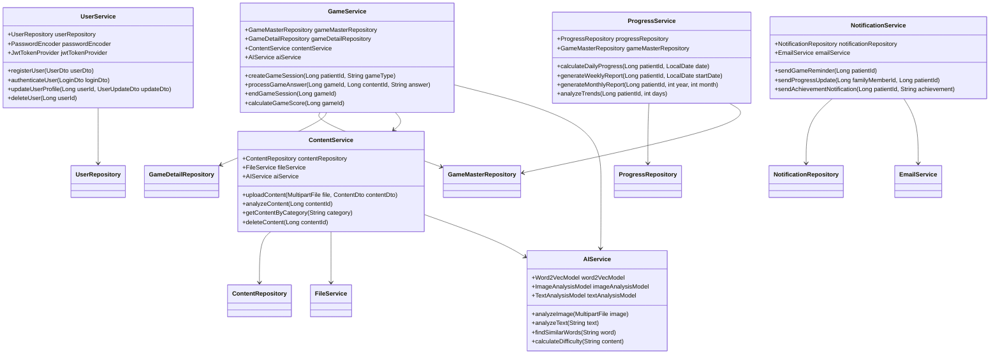
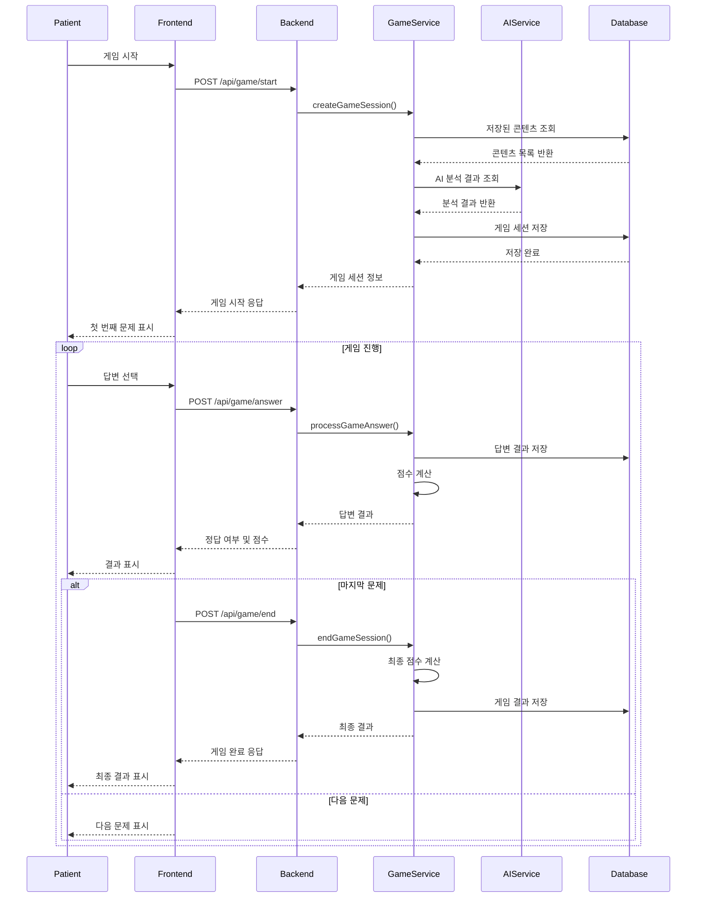
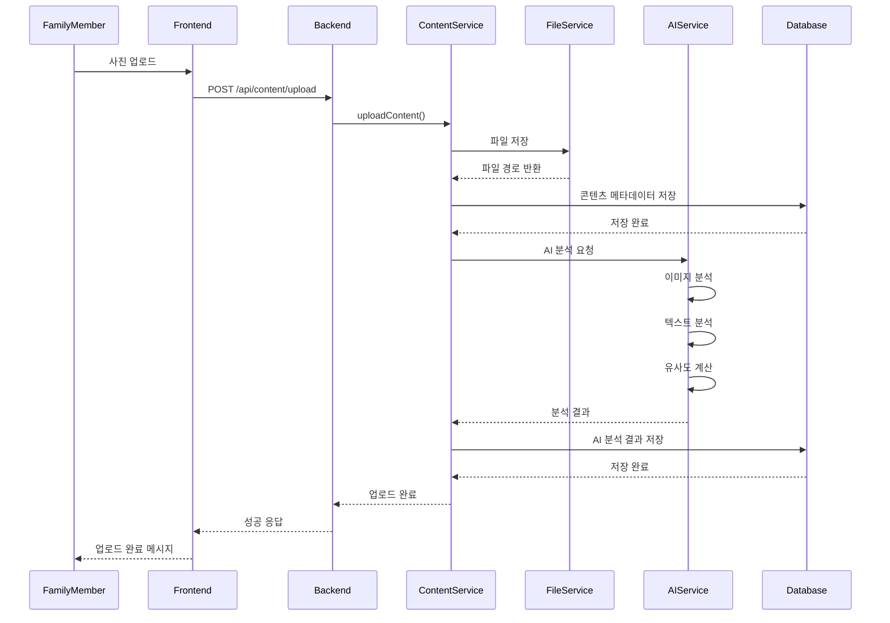
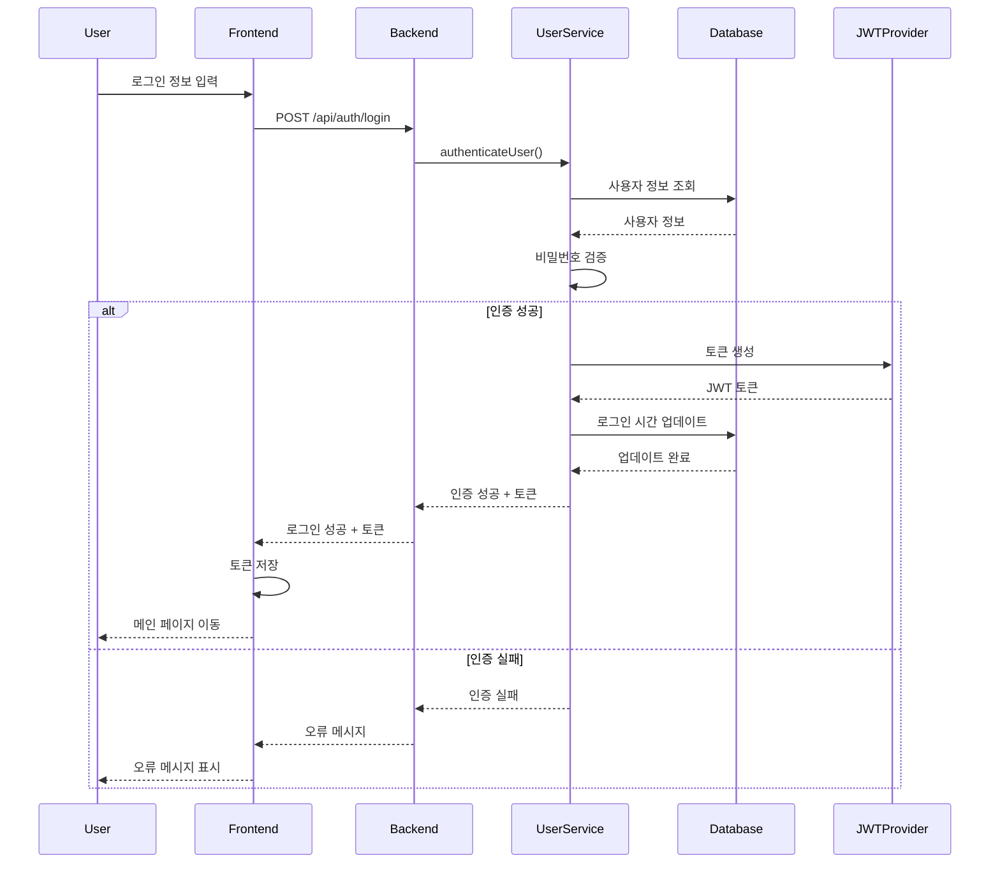
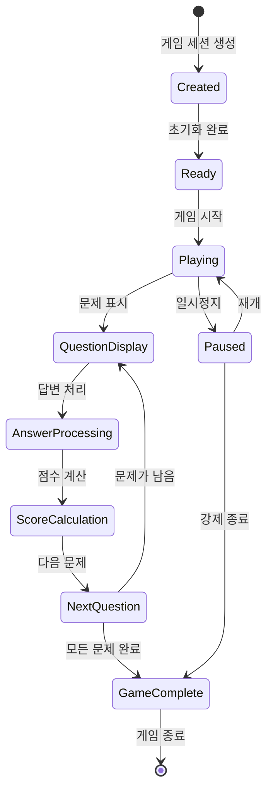
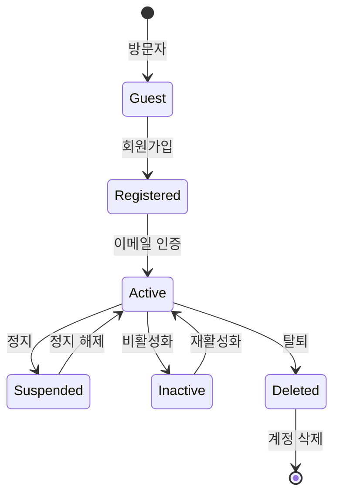
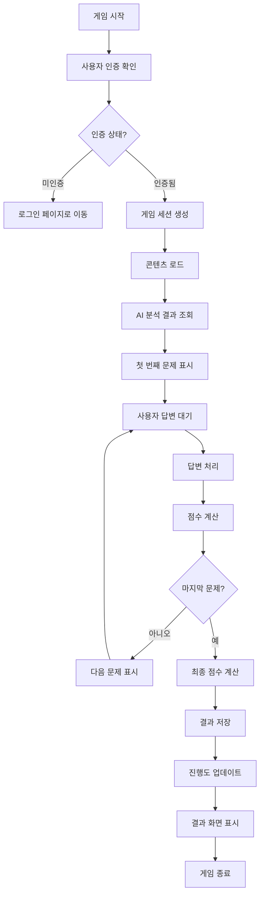

# 📊 **UML 다이어그램 (Unified Modeling Language)**

> **프로젝트명**: Memory Forest - AI 기반 치매 케어 인지 훈련 플랫폼
> 
> **작성일**: 2025.01.15
> 
> **작성자**: 시스템 아키텍트

---

## 📋 1. UML 개요

### **1.1 UML 정의**
UML(Unified Modeling Language)은 소프트웨어 시스템을 시각적으로 모델링하기 위한 표준화된 모델링 언어입니다.

### **1.2 UML 다이어그램 종류**
- **구조 다이어그램**: 클래스, 객체, 컴포넌트, 배치 다이어그램
- **행위 다이어그램**: 유스케이스, 활동, 상태, 시퀀스 다이어그램

---

## 🏗️ 2. 클래스 다이어그램

### **2.1 도메인 모델 클래스 다이어그램**

```mermaid
classDiagram
    class User {
        +Long id
        +String email
        +String name
        +String role
        +LocalDateTime createdAt
        +LocalDateTime updatedAt
        +createUser()
        +updateUser()
        +deleteUser()
    }

    class Patient {
        +Long id
        +Long userId
        +String name
        +int age
        +String gender
        +String diagnosis
        +LocalDateTime diagnosisDate
        +createPatient()
        +updatePatient()
    }

    class FamilyMember {
        +Long id
        +Long userId
        +Long patientId
        +String relationship
        +String phoneNumber
        +createFamilyMember()
        +updateFamilyMember()
    }

    class GameMaster {
        +Long id
        +Long patientId
        +String gameType
        +LocalDateTime startTime
        +LocalDateTime endTime
        +int totalScore
        +createGame()
        +endGame()
        +calculateScore()
    }

    class GameDetail {
        +Long id
        +Long gameMasterId
        +Long contentId
        +String question
        +String correctAnswer
        +String userAnswer
        +boolean isCorrect
        +int responseTime
        +int score
        +processAnswer()
        +calculateScore()
    }

    class Content {
        +Long id
        +Long userId
        +String fileName
        +String originalFileName
        +String filePath
        +String description
        +String category
        +LocalDateTime uploadDate
        +uploadContent()
        +updateContent()
        +deleteContent()
    }

    class AIAnalysis {
        +Long id
        +Long contentId
        +String analysisType
        +String keywords
        +String similarWords
        +double difficultyScore
        +LocalDateTime analysisDate
        +analyzeContent()
        +generateQuestions()
    }

    class Progress {
        +Long id
        +Long patientId
        +LocalDate date
        +int gamesPlayed
        +double averageScore
        +int totalPlayTime
        +updateProgress()
        +calculateTrends()
    }

    class Notification {
        +Long id
        +Long userId
        +String type
        +String message
        +boolean isRead
        +LocalDateTime createdAt
        +sendNotification()
        +markAsRead()
    }

    User ||--o{ Patient : manages
    User ||--o{ FamilyMember : has
    Patient ||--o{ GameMaster : plays
    GameMaster ||--o{ GameDetail : contains
    Content ||--o{ AIAnalysis : analyzed_by
    Patient ||--o{ Progress : tracks
    User ||--o{ Notification : receives
    FamilyMember ||--o{ Patient : cares_for
```

### **2.2 서비스 레이어 클래스 다이어그램**



---

## 🔄 3. 시퀀스 다이어그램

### **3.1 게임 플레이 시퀀스**



### **3.2 콘텐츠 업로드 시퀀스**



### **3.3 사용자 인증 시퀀스**



---

## 📊 4. 상태 다이어그램

### **4.1 게임 세션 상태 다이어그램**



### **4.2 사용자 계정 상태 다이어그램**



---

## 🔗 5. 컴포넌트 다이어그램

### **5.1 시스템 컴포넌트 구조**

```mermaid
component
    component "Frontend (React)" {
        component "Game Components" as GC
        component "User Components" as UC
        component "Admin Components" as AC
        component "Common Components" as CC
    }
    
    component "Backend (Spring Boot)" {
        component "User Controller" as UController
        component "Game Controller" as GController
        component "Content Controller" as CController
        component "Admin Controller" as AController
    }
    
    component "AI Service (FastAPI)" {
        component "Image Analysis" as IA
        component "Text Analysis" as TA
        component "Word2Vec Model" as WV
    }
    
    component "Database" {
        component "MySQL" as DB
        component "Redis Cache" as Cache
    }
    
    component "External Services" {
        component "File Storage (S3)" as S3
        component "Email Service" as Email
    }
    
    Frontend --> Backend : HTTP/REST
    Backend --> AI Service : HTTP/REST
    Backend --> Database : JDBC/JPA
    Backend --> External Services : HTTP/API
    AI Service --> Database : Database Connection
```

---

## 📋 6. 배치 다이어그램

### **6.1 시스템 배치 구조**

```mermaid
deployment
    node "Client Browser" {
        component "React SPA" as React
    }
    
    node "Load Balancer" {
        component "Nginx" as LB
    }
    
    node "Web Server 1" {
        component "Spring Boot App" as App1
        component "JVM" as JVM1
    }
    
    node "Web Server 2" {
        component "Spring Boot App" as App2
        component "JVM" as JVM2
    }
    
    node "AI Server" {
        component "FastAPI App" as AI
        component "Python Runtime" as Python
    }
    
    node "Database Server" {
        component "MySQL" as MySQL
        component "Redis" as Redis
    }
    
    node "Storage Server" {
        component "AWS S3" as S3
    }
    
    React --> LB : HTTPS
    LB --> App1 : HTTP
    LB --> App2 : HTTP
    App1 --> AI : HTTP
    App2 --> AI : HTTP
    App1 --> MySQL : JDBC
    App2 --> MySQL : JDBC
    App1 --> Redis : Jedis
    App2 --> Redis : Jedis
    App1 --> S3 : AWS SDK
    App2 --> S3 : AWS SDK
    AI --> MySQL : SQLAlchemy
```

---

## 📊 7. 활동 다이어그램

### **7.1 게임 플레이 활동 흐름**



---

## 📋 8. UML 모델 검증

### **8.1 모델 검증 체크리스트**

- [ ] **구조적 일관성**: 클래스 간 관계가 논리적으로 일치하는가?
- [ ] **명명 규칙**: 모든 요소가 명명 규칙을 따르는가?
- [ ] **완전성**: 모든 주요 기능이 모델에 포함되어 있는가?
- [ ] **명확성**: 다이어그램이 이해하기 쉬운가?
- [ ] **확장성**: 향후 기능 추가를 고려한 설계인가?

### **8.2 모델 개선 방안**

1. **성능 최적화**: 데이터베이스 쿼리 최적화를 위한 인덱스 설계
2. **보안 강화**: 인증/인가 로직의 세분화
3. **모니터링**: 시스템 상태 추적을 위한 로깅 구조
4. **확장성**: 마이크로서비스 아키텍처로의 전환 고려

---

**문서 정보**
- 작성일: 2025년 1월 15일
- 버전: v1.0
- 작성자: 시스템 아키텍트
- 검토자: 기술 책임자
- 승인자: CTO
