# 📊 **UML 다이어그램 (Unified Modeling Language)**

> **프로젝트명**: Memory Forest - AI 기반 치매 케어 인지 훈련 플랫폼
> 
> **작성일**: 2025.01.15
> 
> **작성자**: 시스템 아키텍트

---

## 📋 1. UML 개요

### **1.1 UML 정의**
UML(Unified Modeling Language)은 소프트웨어 시스템을 시각적으로 모델링하기 위한 표준화된 모델링 언어입니다.

### **1.2 UML 다이어그램 종류**
- **구조 다이어그램**: 클래스, 객체, 컴포넌트, 배치 다이어그램
- **행위 다이어그램**: 유스케이스, 활동, 상태, 시퀀스 다이어그램

---

## 🏗️ 2. 클래스 다이어그램

### **2.1 도메인 모델 클래스 다이어그램**

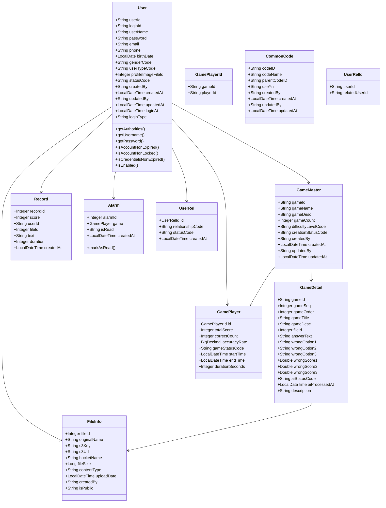

### **2.2 서비스 레이어 클래스 다이어그램**

```mermaid
classDiagram
    class UserService {
        +UserRepository userRepository
        +PasswordEncoder passwordEncoder
        +JwtTokenProvider jwtTokenProvider
        +registerUser(UserDto userDto)
        +authenticateUser(LoginDto loginDto)
        +updateUserProfile(String userId, UserUpdateDto updateDto)
        +deleteUser(String userId)
    }

    class GameService {
        +GameMasterRepository gameMasterRepository
        +GameDetailRepository gameDetailRepository
        +GamePlayerRepository gamePlayerRepository
        +ContentService contentService
        +AIService aiService
        +createGameSession(String patientId, String gameType)
        +processGameAnswer(String gameId, Integer gameSeq, String answer)
        +endGameSession(String gameId)
        +calculateGameScore(String gameId)
    }

    class GameMasterService {
        +GameMasterRepository gameMasterRepository
        +GameDetailRepository gameDetailRepository
        +createGame(GameCreateRequestDto requestDto)
        +updateGameStatus(String gameId, String statusCode)
        +getGameDashboard(GameDashboardRequestDto requestDto)
    }

    class ContentService {
        +ContentRepository contentRepository
        +FileService fileService
        +AIService aiService
        +uploadContent(MultipartFile file, ContentDto contentDto)
        +analyzeContent(Long contentId)
        +getContentByCategory(String category)
        +deleteContent(Long contentId)
    }

    class AIService {
        +Word2VecModel word2VecModel
        +ImageAnalysisModel imageAnalysisModel
        +TextAnalysisModel textAnalysisModel
        +analyzeImage(MultipartFile image)
        +analyzeText(String text)
        +findSimilarWords(String word)
        +calculateDifficulty(String content)
        +generateWrongOptions(String answerText, String difficulty)
    }

    class ProgressService {
        +ProgressRepository progressRepository
        +GameMasterRepository gameMasterRepository
        +GamePlayerRepository gamePlayerRepository
        +calculateDailyProgress(String patientId, LocalDate date)
        +generateWeeklyReport(String patientId, LocalDate startDate)
        +generateMonthlyReport(String patientId, int year, int month)
        +analyzeTrends(String patientId, int days)
    }

    class NotificationService {
        +NotificationRepository notificationRepository
        +EmailService emailService
        +sendGameReminder(String patientId)
        +sendProgressUpdate(String familyMemberId, String patientId)
        +sendAchievementNotification(String patientId, String achievement)
    }

    class AuthService {
        +UserRepository userRepository
        +PasswordEncoder passwordEncoder
        +JwtTokenProvider jwtTokenProvider
        +EmailService emailService
        +login(String loginId, String password)
        +register(RegisterRequestDto requestDto)
        +verifyEmail(String email, String verificationCode)
        +sendVerificationEmail(String email)
    }

    class CustomOAuth2UserService {
        +UserRepository userRepository
        +loadUser(OAuth2UserRequest userRequest)
        +processOAuth2User(OAuth2User oauth2User, String provider)
    }

    UserService --> UserRepository
    GameService --> GameMasterRepository
    GameService --> GameDetailRepository
    GameService --> GamePlayerRepository
    GameService --> ContentService
    GameService --> AIService
    GameMasterService --> GameMasterRepository
    GameMasterService --> GameDetailRepository
    ContentService --> ContentRepository
    ContentService --> FileService
    ContentService --> AIService
    ProgressService --> ProgressRepository
    ProgressService --> GameMasterRepository
    ProgressService --> GamePlayerRepository
    NotificationService --> NotificationRepository
    NotificationService --> EmailService
    AuthService --> UserRepository
    AuthService --> PasswordEncoder
    AuthService --> JwtTokenProvider
    AuthService --> EmailService
    CustomOAuth2UserService --> UserRepository
```

---

## 🔄 3. 시퀀스 다이어그램

### **3.1 게임 플레이 시퀀스**

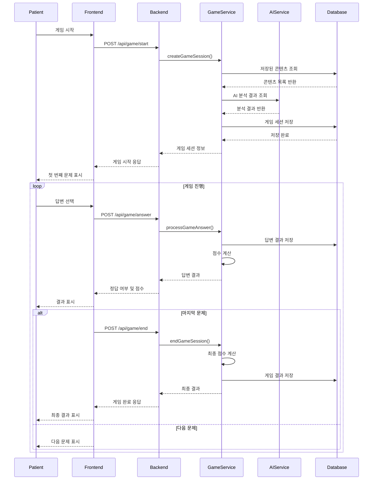

### **3.2 콘텐츠 업로드 시퀀스**

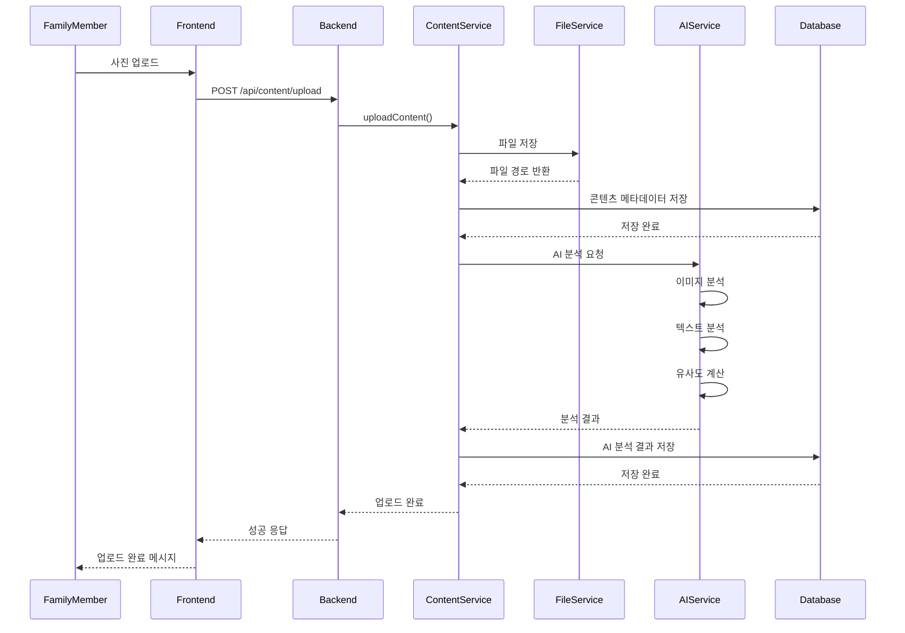

### **3.3 사용자 인증 시퀀스**

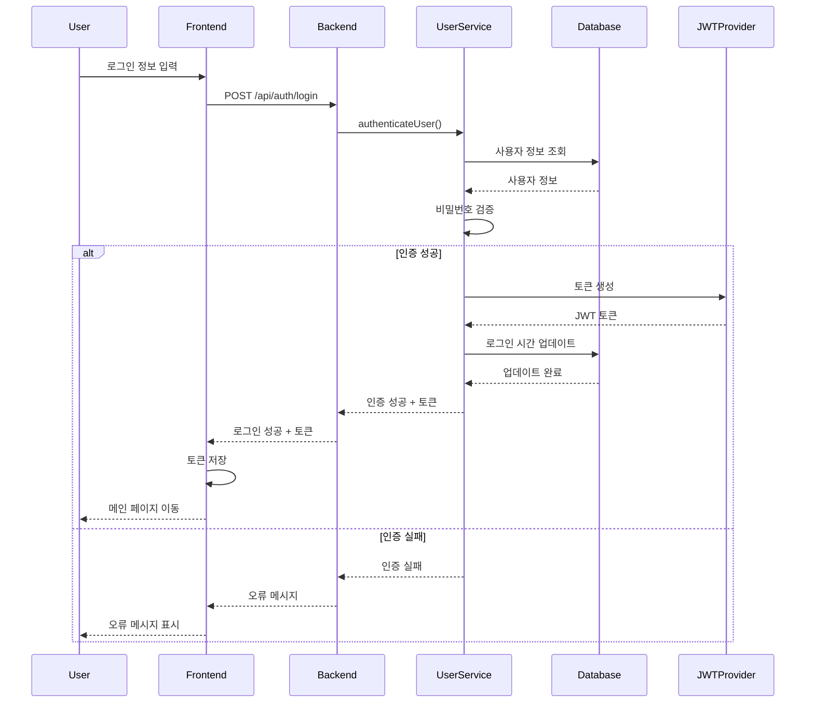

### **3.4 AI 분석 시퀀스**

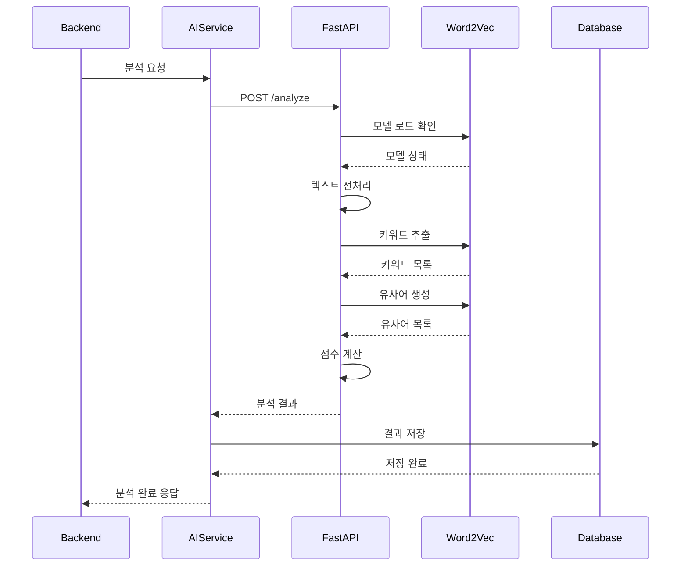

---

## 📊 4. 유스케이스 다이어그램

### **4.1 전체 시스템 유스케이스 다이어그램**

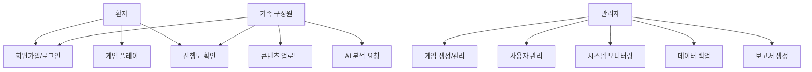

### **4.2 환자 유스케이스 상세**

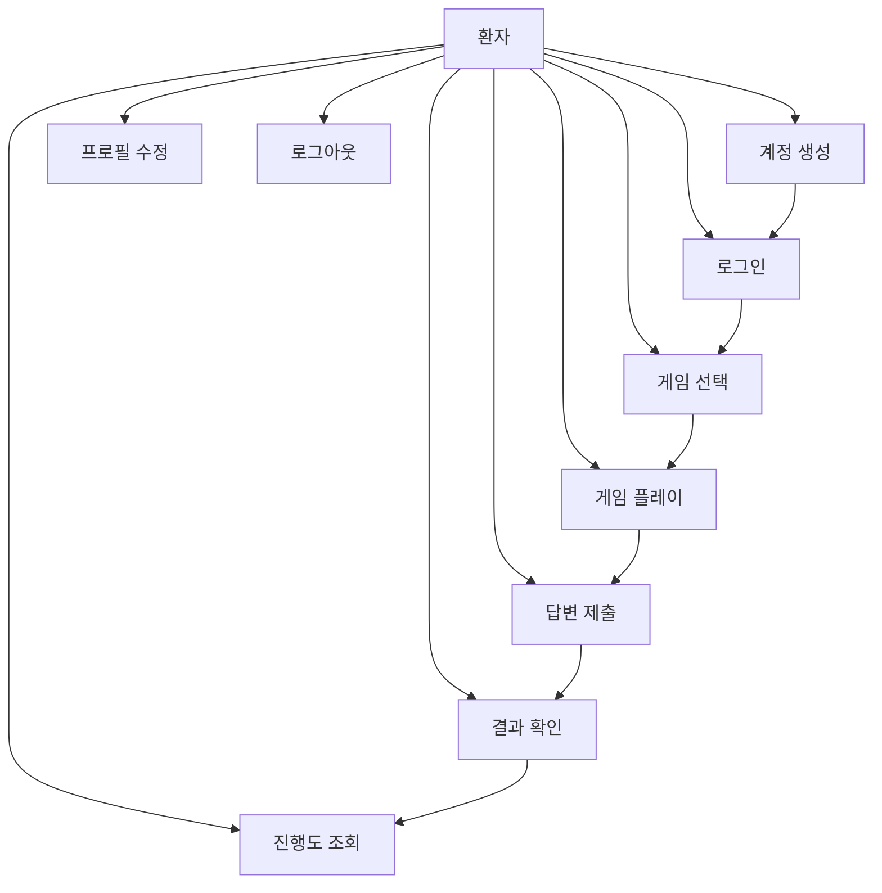

### **4.3 가족 구성원 유스케이스 상세**

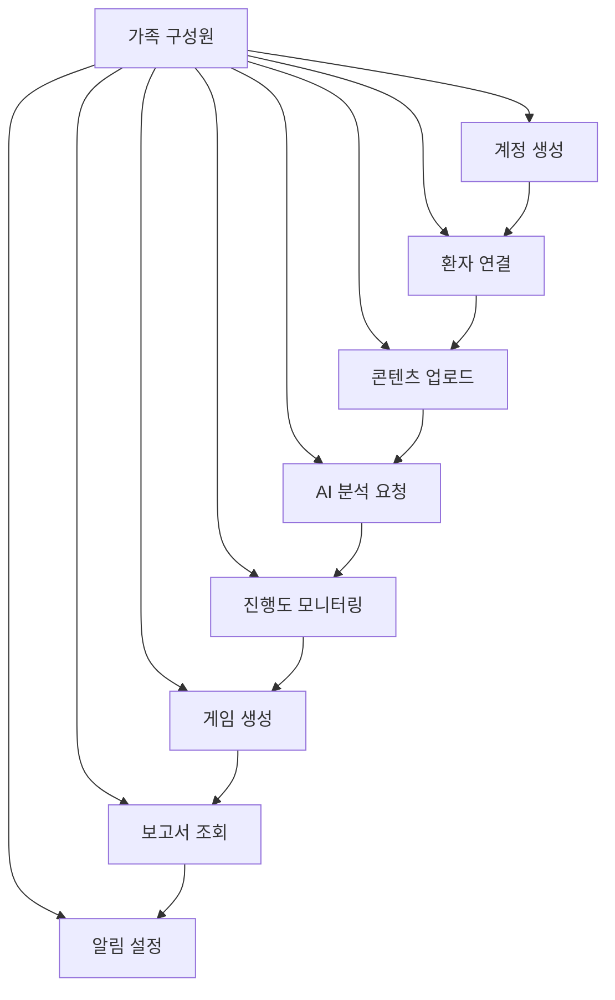

### **4.4 관리자 유스케이스 상세**

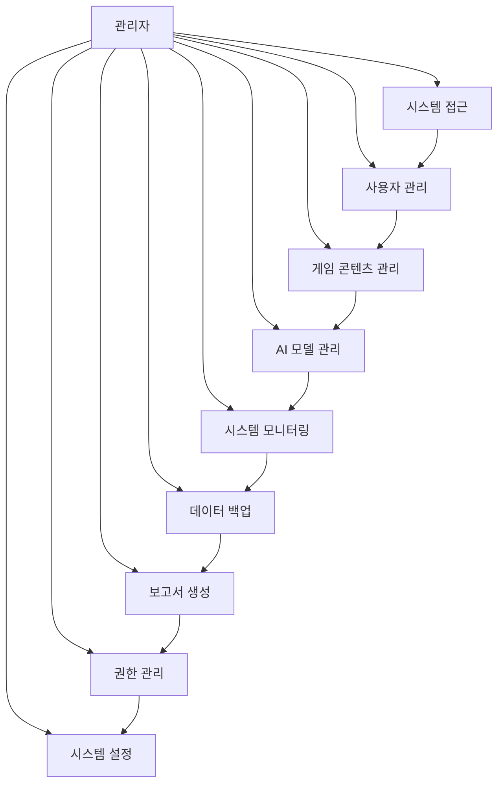

---

## 📊 5. 상태 다이어그램

### **5.1 게임 세션 상태 다이어그램**

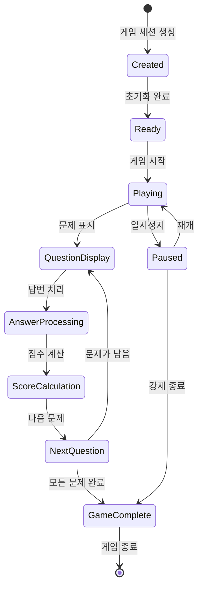

### **5.2 사용자 계정 상태 다이어그램**

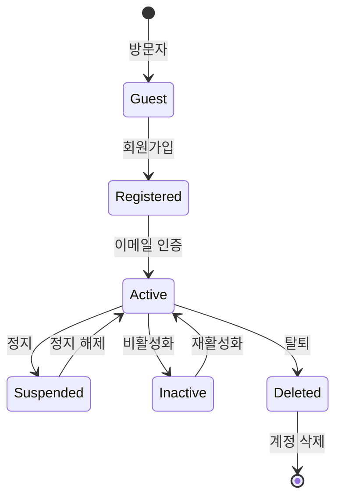

### **5.3 AI 분석 상태 다이어그램**

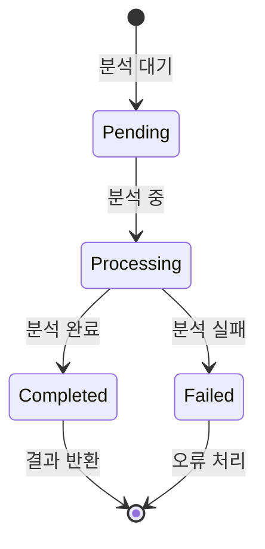

---

## 🔗 6. 컴포넌트 다이어그램

### **6.1 시스템 컴포넌트 구조**

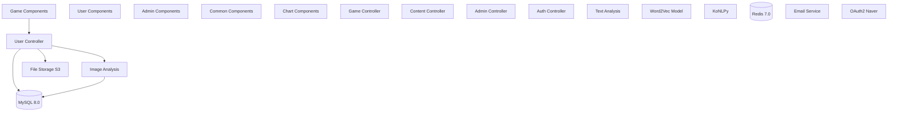

---

## 📋 7. 배치 다이어그램

### **7.1 시스템 배치 구조**

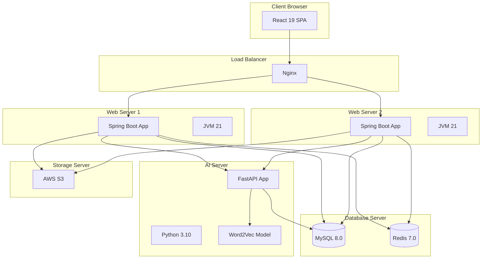

---

## 📊 8. 활동 다이어그램

### **8.1 게임 플레이 활동 흐름**

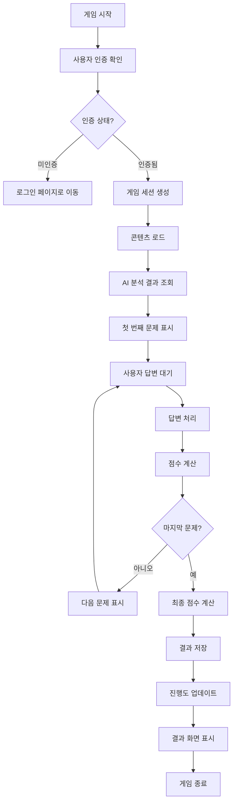

### **8.2 AI 분석 활동 흐름**

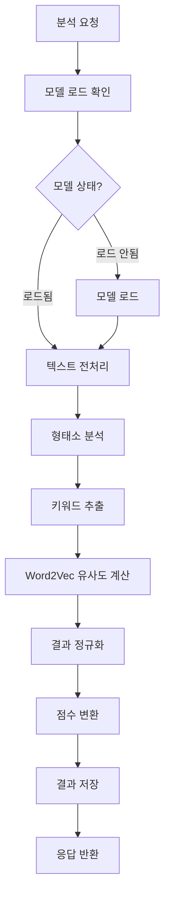

---

## 📋 9. UML 모델 검증

### **9.1 모델 검증 체크리스트**

- [ ] **구조적 일관성**: 클래스 간 관계가 논리적으로 일치하는가?
- [ ] **명명 규칙**: 모든 요소가 명명 규칙을 따르는가?
- [ ] **완전성**: 모든 주요 기능이 모델에 포함되어 있는가?
- [ ] **명확성**: 다이어그램이 이해하기 쉬운가?
- [ ] **확장성**: 향후 기능 추가를 고려한 설계인가?

### **9.2 모델 개선 방안**

1. **성능 최적화**: 데이터베이스 쿼리 최적화를 위한 인덱스 설계
2. **보안 강화**: 인증/인가 로직의 세분화
3. **모니터링**: 시스템 상태 추적을 위한 로깅 구조
4. **확장성**: 마이크로서비스 아키텍처로의 전환 고려

---

**문서 정보**
- 작성일: 2025년 1월 15일
- 버전: v1.0
- 작성자: 시스템 아키텍트
- 검토자: 기술 책임자
- 승인자: CTO
